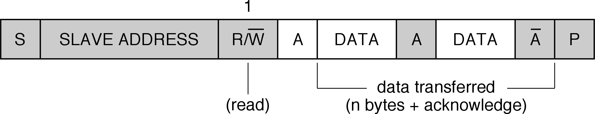

# Control de dispositivos I2C

Para probar los códigos utilizados en los ejemplos de esta práctica necesitamos
disponer de una placa [Inertial One
ATAVRSBIN1](https://ww1.microchip.com/downloads/en/Appnotes/doc8354.pdf).

A lo largo de la práctica repasaremos los conceptos básicos del bus I2C y
veremos cómo podemos comunicarnos con los dispositivos I2C utilizando las
utilidades incluidas en Linux, así como el driver I2C genérico incluido.

## Bus I2C


El Inter-Integrated Circuit (IIC/\IIC{}/I2C) es un bus serie diseñado por
Philips en década del 1980 para la interconexión de periféricos a un
microcontrolador. Proporciona una conexión serie síncrona unidireccional
(halfduplex). Los dispositivos pueden ser máster o slave, permitiéndose la
presencia de varios másters en el bus. El protocolo de trasmisión incorpora un
mecanismo de arbitraje que permite seleccionar el máster que toma el control del
bus en caso de que varios quieran enviar simultáneamente.

El máster es quien inicia y finaliza cada transferencia. Direcciona al esclavo
con el que se quiere comunicar y genera la señal de reloj. El esclavo no puede
enviar o recibir por su cuenta. El bus puede trabajar a varias velocidades:
100Kb/s, 400Kb/s, 1Mb/s, 3.4Mb/s y 5Mb/s y sólo utiliza dos líneas, además de la
tierra común: Serial Data (SDA), que lleva los datos, y Serial Clock (SCL), que
lleva la señal de reloj generada por el master.

En los últimos años se han popularizado algunas variantes de I2C utlizadas en
los computadores personales para el control de algunos sensores, como son
SMBus y PMBus. Estos protocolos pueden utilizarse igual con el driver I2C de
Linux.

Las conexiones a las línea van en colector/drenador abierto (*open
drain/collector*). Se emplean resistencias de *pull-up* externas, de 4.7 K
típicamente, que dejan la linea a Vdd en reposo. Los dispositivos pueden poner
(forzar) las líneas a 0 (*OR* cableada).


La siguiente figura ilustra las sincronizaciones de comienzo y fin de una
transacción I2C. Primero el máster envía comando *START*, una transición Alto a
Bajo de SDA, con SCL en alto. A partir de ese momento el bus se considera
ocupado y se procede al envío de datos (trama), generándose un pulso en *SCL*
por cada bit transferido. El receptor puede mantener *SCL* baja en cualquier
momento si quiere alargar el ciclo de reloj (forzar una espera del master).
La señal SDA se debe mantener estable mientras SCL está alta. Cuando se han
enviado todos los bits de la transacción el máster envía comando *STOP*, una
transacción Bajo a Alto de SDA con SCL en alto. El bus queda libre tras este
comando de *STOP*.


La siguiente figura detalla la estructura de la trama. Como podemos ver, tras el
comando *Start* hay un byte de dirección, que se compone de:

- 7 bits de dirección del esclavo, empezando por el más significativo
- 1 bit de tipo de operación: R/nW
- 1 bit de ACK
 
A continuación se envían uno o más bytes de datos, cada uno de ellos seguidos de
un bit de ACK que debe poner a 0 el receptor. Los bytes de datos se envían
también empezando por el bit más significativo. La transacción termina
normalmente con el envío de un comando de *STOP*. Pero se quiere evitar perder
el bus, el máster puede decidir envía un comando de *START* en lugar del *STOP*
(que se llama *START* repetido), comenzando diréctamente una nueva transmisión.


Así, una transmisión de escritura, en la que un máster envía un dato a un
esclavo tendría la siguiente estructura:


El máster envía un primer byte de dirección del esclavo, indicado el que quiere
escribir. Luego suele enviar un byte de comando, que direcciona el registro en
el que quiere escribir, seguido del dato a escribir.

La operación de lectura normalmente va precedida de una operación de escritura
en la que se envía el comando de lectura, indicando el registro del que se
quiere leer. Después se realiza la operación de lectura propiamente dicha, en la
que el primer byte direcciona el dispositivo y se indique que se quiere hacer
una lectura, y el máster luego genera los suficientes pulsos de reloj para leer
los bytes que enviará el esclavo, activando como corresponda el bit de ACK en
cada byte transferido.




I2C contempla la posibilidad de utilizar direcciones de 10 bits. Para ello, se
reservan las direcciones *11110xy* para indicar que la dirección es de 10 bits:

- Los bits *xy* serán los dos bits más significativos de la dirección
- Los 8 bits restantes se envían en el siguiente byte

No lo soportan todos los controladores I2C, ni es soportado por dispositivos
SMBus. En transacciones escritura-lectura encadenadas sólo se repite el primer
byte de la dirección. En este caso, el esquema de una operación de escritura
es como indica la siguiente figura:

[I2C write 10 bit address](fig/IIC_write_10bitadd.png)

La lectura con un dispositivo con dirección de 10 bits se ilustra en la
siguiente figura:

[I2C read 10 bit address](fig/IIC_read_10bitadd.png)

Existen otras extensiones al bus I2C, que pueden consultarse en la
[especificación de I2C](https://www.i2c-bus.org/specification/).

## I2C en Linux

El driver I2C de Linux expone dispositivos de caracteres */dev/i2c-#*. Para ello
es necesario cargar el módulo i2c-dev. Por cada controlador I2C del SoC
aparecerá un fichero en */sys/class/i2c-dev/*.
    
El paquete i2c-tools (puede instalarse con `apt-get install i2c-tools`) nos da
algunas herramientas interesantes:

- *i2cdetect -l*: nos da una lista de controladores i2c en el sistema
- *i2cdetect -y #*: escanea el bus *i2c-#* y nos dice los dispositivos
  detectados y sus direcciones
- *i2cget*: permite leer registros de dispositivos conectados al bus. Por
  ejemplo:

```sh 
i2cget -y  1 0x68 0x1c b
```
- *i2cset*: permite escribir en registros de dispositivos conectados al bus.
- *i2ctransfer*: nos permite hacer transferencias encadenadas con *slaves*
  conectados al bus. Por ejemplo:

```sh 
i2ctransfer -y 1 w1@0x68 0x1c r1
```


Hay tres tipos de transaccionees soportadas por el driver:

- Transacciones I2C estándar:
    - Operaciones *read/write* independientes
    - Bit de stop detrás de cada una
    - Para leer un registro primero hacemos una op de escritura con el número
      del registro y luego una operación de lectura para leer el valor

- Transacciones I2C encadenadas con *ioctl*
    - Varias transacciones con una sola operación *ioctl* tipo *I2C_RDWR* 
    - Por defecto con repeated start
    - Puede usarse para leer un registro, concatenando el write del comando con
      el read siguiente

- Transacciones SMBus
    - API específico y simplificado implementado en la libi2c
    - Se prefiere su uso para dispositivos compatibles

El interfaz está documentado en
[www.kernel.org](https://www.kernel.org/doc/Documentation/i2c/) y en los
ficheros de cabecera del driver: [i2c-dev.h](/usr/include/linux/i2c-dev.h),
[i2c.h](/usr/include/linux/i2c.h) y [smbus.h](/usr/include/i2c/smbus.h).

Las operaciones *ioctl* soportadas por estos dispositivos son:

- *I2C_SLAVE*: establece la dirección del esclavo, nos ahorramos tener que
  ponerla en cada operación
- *I2C_FUNCS*: nos permite consultar la funcionalidad disponible en el
  controlador
- *I2C_TENBIT*: selección del uso de direcciones de 10 bits. El controlador debe
  tener la funcionalidad *I2C_FUNC_10BIT_ADDR*
- *I2C_RDWR*: Para realizar transacciones de lectura/escritura encadenadas, sin
  bit de stop entre ellas. El controlador debe tener *I2C_FUNC_I2C*.
- *I2C_PEC*: generación y verificación de Packet Error Checking para el
  protocolo SMBus. El controlador debe tener *I2C_FUNC_SMBUS_PEC*
- *I2C_SMBUS*: Para transacciones SMBus.Se recomienda el uso de las funciones
  *i2c_smbus_\**, proporcionadas por la librería *libi2c* (paquete *i2c-tools*),
  que hacen de wrapper sobre la operación *ioctl*

SMBus es un subconjunto de I2C:

- Sólo admite direcciones de 7 bits
- Sólo hasta 100 KHz
- Timeout 35 ms, frecuencia mínima de 10 KHz

El API implementado en libi2c opera sobre la operación ioctl *I2C_SMBUS*:

```c 
__s32 i2c_smbus_write_quick(int file, __u8 value);
__s32 i2c_smbus_read_byte(int file);
__s32 i2c_smbus_write_byte(int file, __u8 value);
__s32 i2c_smbus_read_byte_data(int file, __u8 command);
__s32 i2c_smbus_write_byte_data(int file, __u8 command, __u8 value);
__s32 i2c_smbus_read_word_data(int file, __u8 command);
__s32 i2c_smbus_write_word_data(int file, __u8 command, __u16 value);
/* Returns the number of read bytes */
__s32 i2c_smbus_read_block_data(int file, __u8 command, __u8 *values);
__s32 i2c_smbus_write_block_data(int file, __u8 command, __u8 length, 
                                 const __u8 *values);
```

El API completo se documenta en */usr/include/i2c/smbus.h*.

### Ejemplo de transacciones I2C estándar


El siguiente código es un ejemplo de lectura de un registro de tamaño byte de un
sensor i2c, usando una transacción I2C estándar con el driver I2C de Linux:

```c 
int addr = 0x68;              // Dirección del sensor I2C
unsigned char regid = 0x1b;   // Id del registro a leer
unsigned char buf;            // buffer para el valor leído
int fd;

fd = open("/dev/i2c-1", O_RDWR);
ioctl(fd, I2C_SLAVE, addr);

write(fd, &regid, 1);  // Transacción de escritura/comando
read(fd, &buf, 1);     // Transacción de lectura
```

### Ejemplo de transacción I2C encadenada


El siguiente código es un ejemplo de una transacción encadenada con el driver de
I2C de Linux en el que se hace la misma lectura que en el ejemplo anterior, pero
encadenando la operación de escritura (que indica el registro a leer) y la
operación de lectura posterior:

```c 
int fd;                    // descriptor de fichero
int addr = 0x68;           // Dirección del sensor I2C
char wbuf[1] = {0x1b};     // Id del registro a leer
char rbuf[1];              // buffer para el valor leído
struct i2c_msg msgs[2];    // variables para la op ioctl
struct i2c_rdwr_ioctl_data i2cdata;

// Transacción de escritura / comando
msgs[0].addr = addr;
msgs[0].flags = 0;
msgs[0].len = 1;
msgs[0].buf = wbuf;
// Transacción de lectura
msgs[1].addr = addr;
msgs[1].flags = I2C_M_RD;
msgs[1].len = 1;
msgs[1].buf = rbuf;

fd = open("/dev/i2c-1", O_RDWR);
// ioctl para realizar las dos transacciones
i2cdata.msgs = msgs;
i2cdata.nmsgs = 2;
ioctl(fd, I2C_RDWR, &i2cdata); // Operaciones encadenadas
```

### Ejemplo de transacción SMBus


La misma lectura de un registro de tamaño byte usando el API SMBus se realizaría
del siguiente modo:

```c 
int addr = 0x68;              // Dirección del sensor I2C
unsigned char regid = 0x1b;   // Id del registro a leer
unsigned char buf;            // buffer para el valor leído
int fd, ret;

fd = open("/dev/i2c-1", O_RDWR);
ioctl(fd, I2C_SLAVE, addr);

ret = i2c_smbus_read_byte_data(fd, regid);
buf = ret;
```


## Ejemplo: lectura del sensor Inertial One

La placa [Inertial One
ATAVRSBIN1](https://ww1.microchip.com/downloads/en/Appnotes/doc8354.pdf)
contiene 3 dispositivos i2c:

- Acelerómetro de tres ejes Bosh Sensortech (BMA-150)
- Giróscopo de tres ejes InvenSense (ITG-3200)
- Brújula Electrónica de tres ejes AKM (AK8975)

Podemos conectarla a la placa BEE del siguiente modo:

- Pin 1 del Jumper J2 a SDA
- Pin 2 del Jumper J2 a SCL
- Pin 9 del Jumper J2 a Gnd
- Pin 10 del Jumper J2 a Vdd

Para comprobar que está bien conectada podemos usar el comando *i2cdetect -y 1*:

```sh 
pi@raspberrypi:~/ejemplos $ i2cdetect -y 1
     0  1  2  3  4  5  6  7  8  9  a  b  c  d  e  f
00:                         -- -- -- -- 0c -- -- --
10: -- -- -- -- -- -- -- -- -- -- -- -- -- -- -- --
20: -- -- -- -- -- -- -- -- -- -- -- -- -- -- -- --
30: -- -- -- -- -- -- -- -- 38 -- -- -- -- -- -- --
40: -- -- -- -- -- -- -- -- -- -- -- -- -- -- -- --
50: -- -- -- -- -- -- -- -- -- -- -- -- -- -- -- --
60: -- -- -- -- -- -- -- -- 68 -- -- -- -- -- -- --
70: -- -- -- -- -- -- -- --
pi@raspberrypi:~/ejemplos $
```

El Giróscopo ITG-3200 del Inertial One tiene asignada la dirección 0x68, e
integra cuatro sensores de 16 bits accesibles en los siguientes registros:


Como puede verse, cada sensor tiene dos registros, uno con los 8 bits más
significativos y otro con los 8 bits menos significativos. El programa de
ejemplo [itg3200_sensors.c](src/itg3200_sensors.c) lee estos sensores y muestra
su valor por la salida estándar. Los flags de la línea de comandos permiten
seleccionar los tres tipos de transacciones para leer estos valores. Examina el
programa y prueba a utilizarlo leyendo cada uno de los registros. Comprueba que
funcionan los tres tipos de transacciones.

### Ejercicio

Diseñar un programa que lea los valores *acc_x*, *acc_y* y *acc_z* del
acelerómetro BMA 150 incluido en la unidad inercial. Consultar el
[datasheet](https://www.tomark.co.uk/wp-content/uploads/2021/05/BMA150.pdf) del
componente para:

- Determinar los registros que hay que leer
- Determinar el registro de configuración del:
    - rango de medida, seleccionar el rango [-2g, 2g)
    - el ancho de banda, seleccionar 25 Hz
- Determinar la sensibilidad de la medida

Consultar el[Application Note de NXP [Tilt Sensing Using a Three-Axis
Accelerometer
(AN3461)](https://www.nxp.com/files-static/sensors/doc/app_note/AN3461.pdf) para
determinar cómo obtener los ángulos *roll* y *pitch* a partir de las medidas del
acelerómetro.

