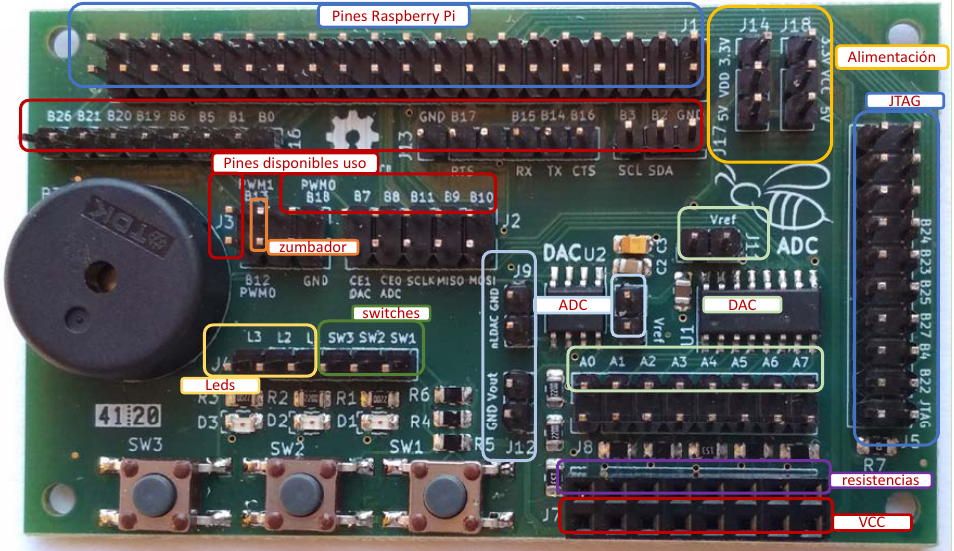
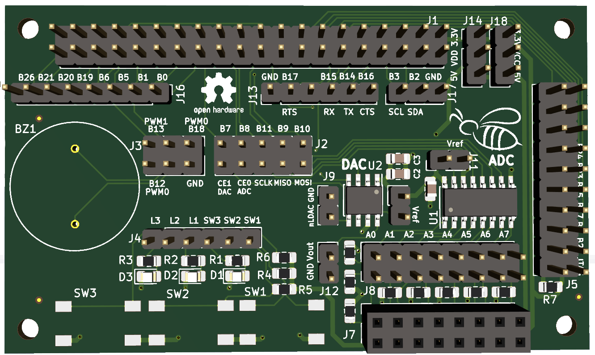
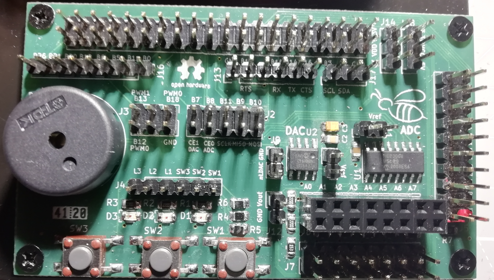
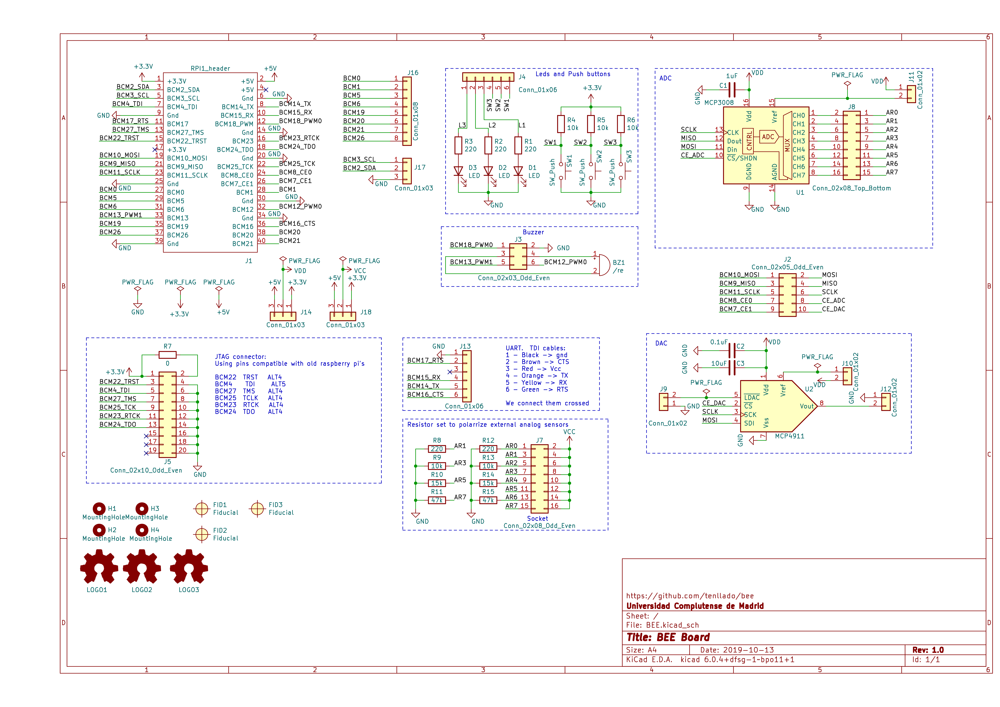
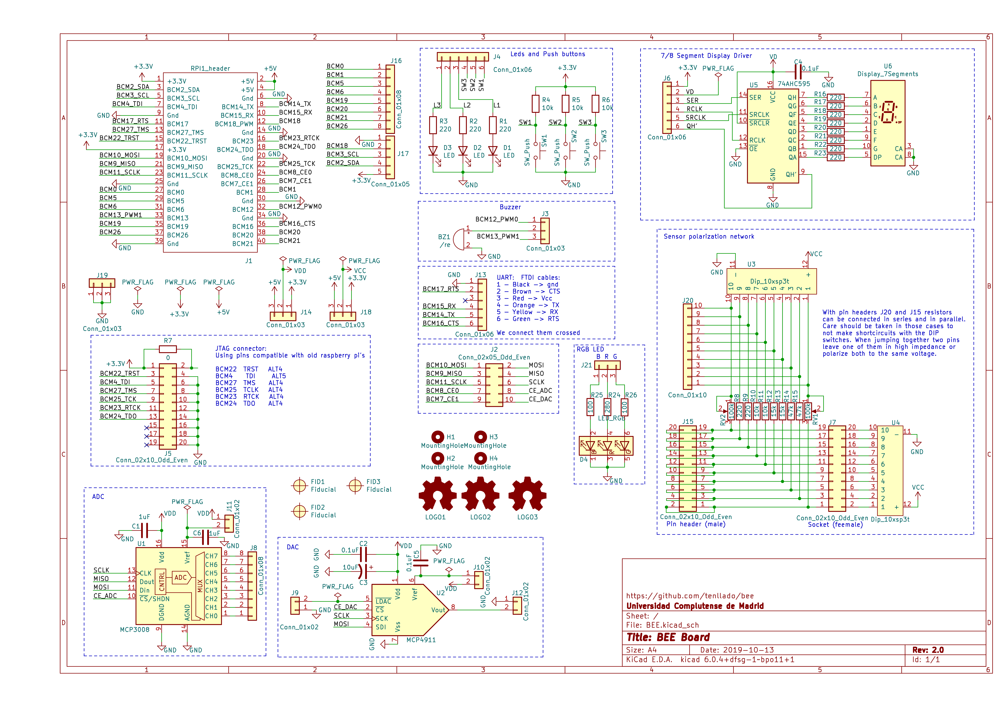

# BEE Docs

## Placa de expansión BEE

La placa BEE fué desarrollada como una placa de expansión para la primera
versión de la Raspberry Pi, con el fin de facilitar montar puestos de
laboratorio económicos en torno a este *computador de una sola placa*.

La placa BEE proporciona una serie de periféricos que son fácilmente conectables
a los pines GPIO de la raspberry pi. En lugar de proporcionar una conexión fija
entre los periféricos y los GPIOS de del microcontrolador, es el usuario el que
debe conectar cada uno de los periféricos a los pines deseados usando cables de
puente dupont hembra-hembra.

Los pines de la raspberry pi se han dejado disponibles en distintas tiras de
pines en la propia placa de expansión. Algunas de estas tiras de pines se han
colocado junto a los circuitos de algun periférico, debido a que la
funcionalidad adicional de estos pines está relacionada con dicho periférico Por
ejemplo, los pines que proporcionan conexiones a los controladores hardware de
PWM se han colocado junto al circuito del zumbador. Para esos casos la conexión
entre el periférico y la raspberry pi puede hacerse de forma cómoda y sencilla
usando jumpers.

En todo momento se ha evitado que un pin pueda ser conectado a más de un
dispositivo externo, para evitar cortocircuitos provocados por los estudiantes
menos cuidadosos.

Se han desarrollado hasta el momento dos versiones de la placa BEE. La primera
versión (v1) es más pequeña y económica de manejar, y contiene un conjunto más
reducido de dispositivos, pensados inicialmente para dar servicio a los
laboratorios de un par de asignaturas del Grado de Ingeniería Electrónica de
Comunicaciones y otro par de asignaturas del Master de Nuevas Tecnologías
Electrónicas y fotónicas, ambas en la Facultad de CC. Físicas de la Universidad
Complutense de Madrid.

La segunda versión (v2) extiende el conjunto de dispositivos incluidos para
ampliar el espectro de asignaturas que pueden sacar provecho de esta económica y
versátil placa de expansión.

En ambas versiones, los pines etiquetados como Bx en la placa BEE, tanto en el
esquemático como en la serigrafía sobre la propia pcb, se corresponden con los
pines BCMx de la documentación de Broadcom, también denotados como GPIOx en
algunos sitios web, como por ejemplo en [https://pinout.xyz/](https://pinout.xyz/).

Como ejemplo, la siguiente figura muestra la disposición de las tiras de pines
en la BEE v1, marcando en rojo las tiras que exponen los pines de la raspberry
pi (etiquetados como Bx en la serigrafía). Como única excepción, los pines
B22-B25 y B27, que deben usarse en el caso de realizar una depuración en
circuito con el controlador JTAG, están disponibles en la tira etiquetada en
azul como JTAG.

Los detalles de estos dos modelos se presentan en las próximas secciones.

## BEE v1

La primera versión de la BEE incluye el siguiente conjunto básico de
dispositivos:

- Un MCP3008. Se trata de un conversor analógico digital (ADC) de 10 bits con 8
  canales. Su montaje en la placa permite una conexión sencilla de sus entradas
  a las salidas de sensores, y su interfaz digital SPI puede ser conectada
  mediante 5 *jumpers* a los pines SPI de la Raspberry Pi por el canal CE0.

- Sockets para la conexión rápida de sensores a la entrada del ADC, con
  posibilidad de polarizar dichos sensores a 0 o alimentación (3.3 V o 5 V).

- Un MCP4911. Se trata de un conversor digital analógico (DAC) de 10 bits, que
  también puede ser conectado al controlador SPI usando los mismos 5 *jumpers*,
  quedando conectado al canal CE1.

- 3 circuitos simples de pulsador, que pueden ser conectados a pines digitales
  de entrada del microcontrolador para recibir acciones de usuario.

- 3 circuitos simples de led polarizado, que permiten encender el led desde un
  programa si se conecta el circuito a un pin de salida del microcontrolador.
 
- Un conector para cables FTDI-232-R con conexión directa a los pines del puerto
  serie de la raspberry pi. Facilita la comunicación serie desde un PC con la
  raspberry pi.
  
- Un conector para JTAG estándar de 20 pines, conectado a los pines de
  depuración en circuito de la raspberry pi.

- 1 Zumbador piezoeléctrico que puede ser conectado con *jumpers* a algunos de
  los pines pwm de la Raspberry PI.

Estos dispositivos están incluidos para dar soporte al desarrollo de prácticas
de las siguientes asignaturas del departamento de Arquitectura de Computadores y
Automática de la Universidad Complutense de Madrid:

- Estructura de Computadores: en la que se realizan prácticas de programación de
  entrada salida *bare-metal*, usando pines digitales de entrada y salida,
  conectados a leds y pulsadores, manejo de puerto serie y conexión a
  dispositivos por SPI o I2C.

- Robótica: se utilizan sensores analógicos y digitales, ADC, DAC y
  controladores PWM.

- Robótica y Mecatrónica: igual que en robótica, se usan sensores analógicos y
  digitales, ADC, DAC, motores, etc.

- Programación de Nodos Sensores para Internet de las Cosas: se utilizan también
  sensores analógicos, temporizadores, controladores PWM, etc.

Las siguientes imágenes muestran un modelo 3D de la BEE v1, una foto aislada de
un montaje real de la placa y su conexión a la Raspberry Pi en el montaje
utilizado el laboratorio del Grado de Ingeniería Electrónica de Comunicaciones
de la Universidad Complutense de Madrid:

Como vemos, la BEE se conecta a la Raspberry Pi a través de la tira de 2x20
pines J1, mediante un cable plano. La totalidad de los pines de la Raspberry
quedan entonces accesibles al usuario a través de otras tiras de pines. 

Los pines quedan distribuidos según su uso entre varias tiras de pines
adicionales, algunas de ellas próximas a los circuitos de periféricos que
generalmente necesitarán de dichos pines para su manejo y control. En estos
casos la conexión entre el periférico y la raspberry pi se puede hacer de forma
cómoda y sencilla utilizando jumpers. 

Se han incorporado dispositivos que se utilizan típicamente en las asignaturas
anteriormente mencionadas.

### Esquemático de la BEE v1

La siguiente figura muestra el esquemático de la primera versión de la placa
BEE:

Cada uno de los bloques de periféricos se explica y documenta en las secciones
correspondientes.

## BEE v2

La segunda versión de la placa extiende los dispositivos incluidos para dar
soporte a un mayor número de asignaturas de nuestro departamento, como por
ejemplo Arquitectura Interna Linux y Android, dónde se programan drivers para
varios tipos de dispositivos en estos sistemas. Asimismo se incorpora una red de
polarización mucho más versátil, con el objetivo de facilitar la polarización de
sensores analógicos que se quieran conectar a la entrada del ADC, proporcionando
las resistencias de polarización más habituales, posibilidades de combinarlas en
serie o en paralelo y microinterruptores para polarizarlas a gnd o alimentación.

Concretamente, en esta versión de la placa se han añadido a los dispositivos
incluidos en la versión 1 la siguiente lista de periféricos: 

- Un desplazador con buffer conectado a un display de 7 segmentos (con punto
  decimal), permite escribir en el display 7 segmentos desde la raspberry-pi
  usando pines genéricos de entrada y salida.

- Un led RGB polarizado, que puede ser operado desde la raspberry pi con pines
  genéricos de entrada salida.

- Una red de polarización de sensores, con micro interruptores y resistencias
  habituales para una polarización de sensores analógicos que quieran conectarse
  a las entradas del ADC. 

La siguiente imagen muestra un modelo 3D de la segunda iteración de la placa:

### Esquemático de la BEE v2

La siguiente figura muestra el esquemático de la primera versión de la placa
BEE:

Cada uno de los bloques de periféricos se explica y documenta en las secciones
correspondientes.

