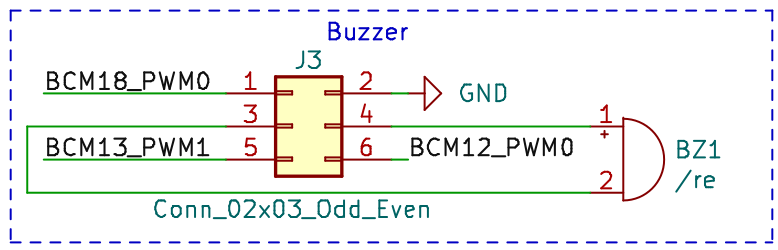

# Placa de expansión BEE

## Descripción general

La BEE es una placa de expansión, diseñada inicialmente para la primera versión
de la Raspberry Pi, pero que pude ser utilizada con cualquiera de las versiones
de este  *computador de una sola placa*. Este complemento convierte a la
Raspberry Pi en una suerte de entrenador económico para estudiar distintas
temáticas de varias titulaciones universitarias del ámbito de las TIC y la
Electrónica.

Este equipo se ha utilizado con gran éxito para montar los puestos de
laboratorio para varias asignaturas de distintas titulaciones del Departamento
de Arquitectura de Computadores y Automática de la Universidad Complutense de
Madrid, limitando tanto el precio que el Departamento ha podido montar un puesto
para cada estudiante, permitiendo que puedan llevarse a casa el material durante
el curso para completar sus prácticas y/o profundizar en las materias implicadas.
El uso de este material fue crucial para que los estudiantes pudiésen realizar
sus prácticas durante la pandemia de covid de 2019 y 2020.

La placa BEE incorpora una serie de periféricos que son fácilmente conectables
a los pines GPIO de la raspberry pi. En lugar de proporcionar una conexión fija
entre los periféricos y los GPIOS de del microcontrolador, es el usuario el que
debe conectar cada uno de los periféricos a los pines deseados usando cables de
puente dupont hembra-hembra o *jumpers*.

Los pines de la raspberry pi se han dejado disponibles en distintas tiras de
pines sobre la propia placa de expansión. En algunos casos se han colocado junto
a los circuitos de algun periférico, debido a que la funcionalidad adicional de
estos pines está relacionada con dicho periférico. Por ejemplo, los pines que
proporcionan conexiones a los controladores hardware de PWM se han colocado
junto al circuito del zumbador. Para esos casos la conexión entre el periférico
y la raspberry pi puede hacerse de forma cómoda y sencilla usando jumpers.

En todo momento se ha evitado que un pin pueda ser conectado a más de un
dispositivo externo, para evitar cortocircuitos provocados por los estudiantes
menos cuidadosos.

Se han desarrollado hasta el momento dos versiones de la placa BEE. La primera
versión (v1) es más pequeña y económica, y contiene un conjunto más reducido de
dispositivos pensados inicialmente para dar servicio a los laboratorios de un
par de asignaturas del Grado de Ingeniería Electrónica de Comunicaciones del
Master de Nuevas Tecnologías Electrónicas y fotónicas de la Facultad de CC.
Físicas de la Universidad Complutense de Madrid.

La segunda versión (v2) extiende el conjunto de dispositivos incluidos para
ampliar el espectro de asignaturas que pueden sacar provecho de esta económica y
versátil placa de expansión. Esta segunda versión ha empezado a utilizarse
también en la Facultad de Informática de la Universidad Complutense de Madrid en
asignaturas de Robótica y Arquitectura Interna de Linux y Android.

En ambas versiones, los pines etiquetados como Bx en la placa BEE, tanto en el
esquemático como en la serigrafía sobre la propia pcb, se corresponden con los
pines BCMx de la documentación de Broadcom, también denotados como GPIOx en
algunos sitios web, como por ejemplo en [https://pinout.xyz/](https://pinout.xyz/).

Los detalles de estos dos modelos se presentan en las próximas secciones.

## BEE v1

La primera versión de la BEE incluye el siguiente conjunto básico de
dispositivos:

- Un MCP3008. Se trata de un conversor analógico digital (ADC) de 10 bits con 8
  canales. Su interfaz digital SPI puede ser conectada mediante 5 *jumpers* a
  los pines SPI de la Raspberry Pi por el canal CE0.

- Sockets para la conexión rápida de sensores analógicos, que pueden ser
  conectados a las entradas de los canales del ADC mediante *jumpers*. Estos
  sensores pueden ser polarizados haciendo uso de la red de resistencias montada
  en la placa, escogiéndose una alimentación de 3.3 V o 5 V mediante un *jumper*.

- Un MCP4911. Se trata de un conversor digital analógico (DAC) de 10 bits, que
  también puede ser conectado al controlador SPI usando los mismos 5 *jumpers*,
  quedando conectado al canal CE1.

- 3 circuitos simples de pulsador, que pueden ser conectados a pines digitales
  de entrada del microcontrolador para recibir acciones de usuario.

- 3 circuitos simples de led polarizado, que pueden ser conectados a un pin GPIO
  del microntorlador para controlar el estado del led por software. 
 
- Un conector para cables FTDI-232-R con conexión directa a los pines del puerto
  serie de la raspberry pi. Facilita la comunicación serie desde un PC con la
  raspberry pi.
  
- Un conector para JTAG estándar de 20 pines, conectado a los pines de
  depuración en circuito de la raspberry pi.

- 1 Zumbador piezoeléctrico que puede ser conectado con *jumpers* a algunos de
  los pines pwm de la Raspberry PI.

Estos dispositivos están incluidos para dar soporte al desarrollo de prácticas
de las siguientes asignaturas del departamento de Arquitectura de Computadores y
Automática de la Universidad Complutense de Madrid:

- Estructura de Computadores: en la que se realizan prácticas de programación de
  entrada salida *bare-metal*, usando pines digitales de entrada y salida,
  conectados a leds y pulsadores, manejo de puerto serie y conexión a
  dispositivos por SPI o I2C.

- Robótica: se utilizan sensores analógicos y digitales, ADC, DAC y
  controladores PWM.

- Robótica y Mecatrónica: igual que en robótica, se usan sensores analógicos y
  digitales, ADC, DAC, motores, etc.

- Programación de Nodos Sensores para Internet de las Cosas: se utilizan también
  sensores analógicos, temporizadores, controladores PWM, etc.

Las siguientes imágenes muestran un modelo 3D de la BEE v1, una foto aislada de
un montaje real de la placa y su conexión a la Raspberry Pi en el montaje
utilizado el laboratorio del Grado de Ingeniería Electrónica de Comunicaciones
de la Universidad Complutense de Madrid:

Como vemos, la BEE se conecta a la Raspberry Pi a través de la tira de 2x20
pines J1, mediante un cable plano. La totalidad de los pines de la Raspberry
quedan entonces accesibles al usuario a través de otras tiras de pines. 

Los pines quedan distribuidos según su uso entre varias tiras de pines
adicionales, algunas de ellas próximas a los circuitos de periféricos que
generalmente necesitarán de dichos pines para su manejo y control. En estos
casos la conexión entre el periférico y la raspberry pi se puede hacer de forma
cómoda y sencilla utilizando jumpers. 

La siguiente figura muestra la disposición de las tiras de pines en la BEE v1,
marcando en rojo las tiras que exponen los pines de la raspberry pi (etiquetados
como Bx en la serigrafía). Como única excepción, los pines B4, B22-B25 y B27,
que deben usarse en el caso de realizar una depuración en circuito con el
controlador JTAG, están disponibles en la tira etiquetada en azul como JTAG.

La siguiente figura muestra el esquemático de la primera versión de la placa
BEE:

Cada uno de los bloques de periféricos se explica y documenta más abajo, en las
secciones correspondientes a cada uno de ellos.

## BEE v2

La segunda versión de la placa extiende los dispositivos incluidos para dar
soporte a un mayor número de asignaturas del Departamento de Arquitectura de
Computadores y Automática de la UCM, como por ejemplo Arquitectura Interna Linux
y Android, dónde se programan drivers para varios tipos de dispositivos en estos
sistemas. Asimismo se incorpora una red de polarización mucho más versátil, con
el objetivo de facilitar la polarización de sensores analógicos que se quieran
conectar a las entradas del ADC, proporcionando las resistencias de polarización
más habituales, con posibilidad de combinarlas en serie o en paralelo, y
microinterruptores para polarizar el conjunto a Gnd o Vcc.

Concretamente, en esta versión de la placa se han añadido a los dispositivos
incluidos en la versión 1 la siguiente lista de periféricos: 

- Un desplazador con buffer conectado a un display de 7 segmentos (con punto
  decimal), permite escribir en el display 7 segmentos desde la raspberry-pi
  usando pines genéricos de entrada y salida.

- Un led RGB polarizado, que puede ser operado desde la raspberry pi con pines
  genéricos de entrada salida.

- Una red de polarización de sensores, con micro interruptores y resistencias
  habituales para una polarización de sensores analógicos que quieran conectarse
  a las entradas del ADC. 

La siguiente imagen muestra un modelo 3D de la segunda iteración de la placa:

La siguiente figura muestra el esquemático de la primera versión de la placa
BEE:

Los bloques de periféricos se explican y documentan en las siguientes secciones.

## Alimentación de periféricos

Los periféricos con interfaz analógica (ADC y DAC) tienen una línea de
alimentación separada del resto de componentes, Vdd, que puede ser conectada
tanto a 3.3 V como a 5 V colocando un *jumper* en la tira de pines J14:

Por ejemplo, si se van a manejar señales entre 0 y 3.3 V, nos interesará
conectar Vdd a 3.3 V para usar los 10 bits del ADC para discretizar el rango de
0 a 3.3V, teniendo así mayor precisión que si lo alimentásemos a 5 V.

Del mismo modo, la tira J18 permite escoger 3.3 V o 5 V para la señal Vcc,
disponible para la polarización de sensores analógicos.

## Interruptores y leds

La siguiente figura muestra el esquemático de este sencillo bloque de
periféricos, que es común para las dos versiones de la placa.

Por un lado tenemos tres leds (D1-D3) con el cátodo conectado a GND. El ánodo de
cada uno de ellos se conecta a una resistencia de polarización de 220 Ohmios,
que tiene el otro terminal accesible en uno de los pines de la tira J4. Podemos
así usar un cable de puente dupont para conectar este terminal a un GPIO de la
raspberry pi para controla por software el estado del led: si ponemos el pin a 1
(Vdd) pasará por el led una corriente de unos 7 mA ((3.3 - 1.8)/220 = 7 mA) y el
led se encenderá.

Por otro lado, tenemos tres pulsadores de botón (SW1-SW3), con un terminal
conectado a GND y el otro conectado a una resistencia que a su vez conecta a la
alimentación (3.3 V). El punto entre la resistencia y el pulsador se conecta a
uno de los pines de la tira J4. Podemos conectar estos a un GPIO de la raspberry
pi haciendo uso de nuevo de un cable dupont hembra-hembra. Si dicho GPIO se
configura como entrada podremos usarlo para ver si el pulsador está pulsado (el
valor leído será 0) o sin pulsar (el valor leído será 1). Siempre habrá que
tener en cuenta que en los cambios de estado se producirán rebotes, debido
principalmente a las oscilaciones mecánicas del muelle incluido en el pulsador.
Estos rebotes pueden ser filtrados con ayuda del controlador GPIO de la
raspberry pi, y si es necesario, por software.

## Led RGB

Este periférico sólo está disponible en la BEE v2, su circuito se muestra a
continuación:

Se trata de un [led
rgb](https://www.mouser.es/ProductDetail/Wurth-Elektronik/150505M173300?qs=fAHHVMwC%252Bbi%2FURn4Qu0%2FAA%3D%3D),
conectado en cátodo común a tierra, mientras que los terminales de los 3 ánodos
se conectan cada uno a una resistencia, cuyo otro terminal se expone a través de
la tira de pines J21. Podemos usar cables de puente dupont para conectar estos
terminales a pines GPIO de la raspberry pi con el fin de controlar la intensidad
de los canales Rojo Verde y Azul del led desde el microcontrolador
(habitualmente generando señales PWM).

## Zumbador (Buzzer)

Las dos versiones montan el mismo zumbador piezoeléctrico
([datasheet](https://www.mouser.es/datasheet/2/400/iezoelectronic_buzzer_ps_en-1131915.pdf)),
pero el circuito completo cambia ligéramente de una verisión a la otra.

La siguiente figura muestra el esquemático del circuito en la versión 1 de la
placa BEE. Como vemos, los terminales del zumbador se conectan a los dos pines
centrales de una tira de pines 2x3 (J3), estando el resto de pines de la tira
conectados a tierra (2) o a los GPIOS 18 (1), 13 (5) y 12 (6) de la raspberry
pi. Como indica la web [pinout.xyz](https://pinout.xyz/), estos pines
adicionales pueden configurarse con las funciones PWM0, PWM1 y PWM0
respectivamente, pudiendo así polarizar el zumbador utilizando *jumpers*, como
se explica más abajo.

Este circuito se modificó en la versión 2 de la placa, como muestra la siguiente
figura. En este caso los terminales del zumbador se han conectado diréctamente a
tierra y al terminal central de una tira de pines 1x3 (J3). Los pines restantes
de esta tira se han conectado a los GPIOs 12 (PWM0) y 13 (PWM1) de la raspberry
pi.

En ambos versiones puede usarse un *jumper* para conectar el zumbador al pin 12
(PWM0) o el 13 (PWM1), y probar así el uso del zumbador con señales PWM
generadas con los cotroladores internos del microcontrolador. En la versión 1 de
la placa deberemos usar otro jumper para conectar el otro extremo a tierra.

## Conversor Analógico Digital (ADC)

En ambas versiones de la placa se monta un conversor analógico digital
[MCP3008](http://ww1.microchip.com/downloads/en/DeviceDoc/21295d.pdf),
con las siguientes características:

- 10 bits de resolución 
- 8 canales de entrada
- Interfaz SPI
- Entrada independiente para el voltaje de referencia

Los esquemáticos de la conexión del ADC en las dos versiones de la placa se
muestran y explican a continuación. Sólo difieren en la conexión de las entradas
analógicas, debido a la modificación que se realizó en la red de polarización de
sensores. En ambos casos, se debe conectar un voltaje de referencia al ADC antes
de usarlo. Si no se dispone de un voltaje de precisión, la placa proporciona una
forma sencilla de conectar la entrada Vref a la alimentación Vdd del ADC.

En la primera versión de la placa las entradas analógicas del ADC se conectan a
una tira de pines 2x8 (J8), que por el otro lado está conectada a un socket 2x8
(J7), por el lado en el que se conectan unas resistencias de pull down de 220,
10 k, 15 k y 47 k ohmios. Por el otro lado del socket J7 los pines se conectan a
la alimentación analógica (Vcc). 

De esta forma, podemos conectar un sensor analógico de dos patas en el socket
J7, quedando uno de sus terminales conectado a la tira J8 y a una resistencia de
pull-down, y el otro a Vcc. Podemos entonces utilizar un jumper en J8 para
conectar la salida del sensor a la entrada analógica correspondiente del ADC.

Aunque este circuito permite conectar fácilmente muchos sensores analógicos al
ADC, tenemos ciertas limitaciones:

- Sólo podemos usar configuraciones que requieran una resistencia de pull-down.
- Sólo podemos escoger 4 valores para la resistencia de pull-down.

Para salvar estas limitaciones se modificó este circuito en la segunda versión
de la placa.  Se redefinió la red de polarización para facilitar la conexión
serie o paralelo de las resistencias incluidas, así como su conexión como
conjuto de pull-down o pull-up. Además, el nuevo circuito de polarización
introduce dos potenciómetros que nos permiten obtener resistencias de
polarización más especiales. El esqumático se muestra a continuación:

Este circuito está pensado para conectar fácilmente al ADC sensores analógicos
de dos terminales, en los que uno de ellos debe ir conectado directamente a GND
o Vcc, y el otro a una resistencia de pull up o pull down. La salida del sensor
se toma entonces del terminal conectado a la resistencia. En estos casos, el
sensor se conecta al socket J7, escogiendo la posición que lleve a la
resistencia que necesitamos, y usando los micro interruptores de U3 y U4 para
conectar a GND o VCC tanto el sensor como la resistencia seleccionada. La salida
del sensor estará entonces disponible en la tira de pines J15, y podemos usar un
cable dupont hembra-hembra para conectarla a la entrada del ADC deseada,
disponible en J8.

Si ninguna de las resistencias que hay en el circuito es la resistencia que
necesitamos, tenemos dos opciones:

- Conectar dos (o más) de las resistencias disponibles en serie o paralelo para
  obtener la resistencia deseada. Para ello podemos usar las tiras de pines J15
  y J20, y en algún caso un cable dupont.

- Usar los potenciómetros incluidos en la red de polarización, utilizando un
  destornillador pequeño para ajustarlo y un multímetro para medir su valor.

En ambas placas el interfaz digital del ADC está conectado a la tira de pines
J2, que permite conectar con jumpers el ADC (y/o el DAC) a la raspberry pi,
usando los GPIOs que corresponden al controlador SPI (el software debe
configurar dichos gpios para esta funcionalidad). La siguiente figura muestra el
esquemático de este conector:

## Conversor Digital Analógico (DAC)

La placa BEE incorpora también un
[MCP4911](http://ww1.microchip.com/downloads/en/DeviceDoc/22248a.pdf), un
Conversor Digital Analógico (DAC) de 10 bits, que puede ser conectado también al
controlador SPI a través de la tira de pines J2 usando jumpers. El DAC queda
conectado entonces al canal CE1. El esquemático es idéntico en ambas versiones
de la placa:

Como pasaba con el ADC, debemos conectar un voltaje de referencia al DAC.
Podemos colocar un jumper en J10 para conectar la entrada Vref a la tensión de
alimentación del DAC (VDD) si no tenemos una referencia de mayor precisión.
Asimismo, el DAC dispone de una entrada LDAC, que debe ponerse a 0 V para cargar
un nuevo valor en el registro de salida del DAC (consultar el
[Datasheet](http://ww1.microchip.com/downloads/en/DeviceDoc/22248a.pdf) del
componente). La placa BEE conecta esta entrada a la tira J9, de modo que puede
usarse un jumper para conectarlo a 0 permanentemente o utilizar otro GPIO para
activarlo por software cuando sea apropiado.

El voltaje de salida del DAC está disponible en uno de los pines de la tira J12,
estando el otro pin de la tira conectado a GND. Esto facilita la conexión de
cualquier dispositivo que deba ser alimentado con la tensión generada con el
DAC.

Finalmente, como sucede con el ADC, el interfaz digital del DAC se puede
conectar mediante jumpers a los GPIOs del controlador SPI de la raspberry pi
utilizando el conector J2 (el software debe configurar dichos GPIOs para esta
funcionalidad).

## Driver de display 7 segmentos

Este periférico sólo está disponible en la versión 2 de la placa BEE, su
circuito es el siguiente:

Como vemos, se compone principalmente de dos componentes:

- Un registro de desplazamiento [74AHC_AHCT595](https://assets.nexperia.com/documents/data-sheet/74AHC_AHCT595.pdf) 
- Un display de 7 segmentos (más un punto decimal).

El 74AHC595 utiliza doble buffer. Tiene un registro de desplazamiento que
permite cargar en 8 ciclos de la señal SRCLK un valor de 8 bits enviado en serie
por la entrada serie (SER), y un registro de salida, que mantiene inalterado un
valor de 8 bits mientras se carga un nuevo valor en el registro de
desplazamiento. 

El valor almacenado en el registro de salida (QA-QH) se conecta a las entradas
del display 7 segmentos (A-G, DP) a través de 8 resistencias de 220 ohmios para
limitar la corriente. El display mostrará el digito codificado en estos 8 bits
(cada bit indica si se debe encender o no uno de los segmentos). El display es
activo en alta, es decir, que un 1 en la entrada A indica que debe encenderse el
segmento A (ve el símbolo del esquemático), mientras que un 0 en dicha entrada
indicaría que debe apagarse dicho segmento. Como la entrada de habilitación de
la salida (nOE) está conectada a GND, la salida está permanentemente habilitada.

La señal nSRCLR (nMR en el datasheet) permite resetear los biestables del
registro de desplazamiento. Está conectada permanentemente a 1 (no se pueden
resetear).

El resto de señales (SER, SRCLK y RCLK) se conectan a la tira de pines J6, y
podemos usar cables de puente dupont para conectarlos a los pines GPIO que
queramos.

El funcionamiento del dispositivo es como sigue. Los bits se van cargando en
serie en el registro de desplazamiento. Cuando generamos un pulso en la señal
SRCLK, el valor en la entrada serie SER se carge en el biestable 0, el biestable
1 cargará el valor que tenía antes el biestable 0, el biestable 2 el valor que
tenía antes el 1 y así sucesivamente. La salida QH' nos permite conectar en
serie otro 74H595 para almacenar valores de más de 8 bits.

Cuando tengamos el valor completo cargado (8 bits), podemos generar un pulso en
la señal RCLK para cargar los biestables del registro de salida con el contenido
almacenado en el registro de desplazamiento. Esto nos permite ir cargando un
nuevo valor sin alterar lo que se está mostrando en el display 7 segmentos,
mostrando de golpe el nuevo valor cuando se hayan cargado los 8 nuevos bits.

## Conector UART

Se trata de una tira de pines (J13) con la configuración adecuada para que
podamos conectar un cable FTDI-232-R y usar el puerto serie de la
mini-uart que incorpora la raspberry pi, ideal para proporcionar un terminal
serie a cualquier aplicación que corra en el microcontrolador.

## Conector JTAG

Se trata de una tira de pines compatible un conector JTAG de 20 pines. La
raspberry pi incorpora un controlado JTAG de depuración en circuito. Se puede
usar este controlador si se configura correctamente la funcionalidad de los
pines BCM4, BCM22-25 y BCM27, que están rutados a las posiciones adecuadas de
la tira de pines J5.

Para usar el depurador debemos conectar un *dongle JTAG* de depuración a J5, y
usar un software como OpenOCD para establecer una sesión de depuración.
