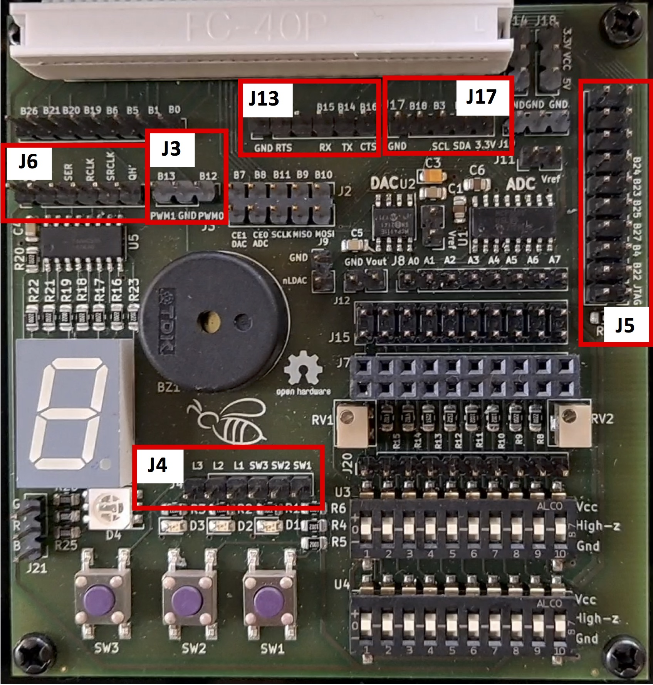
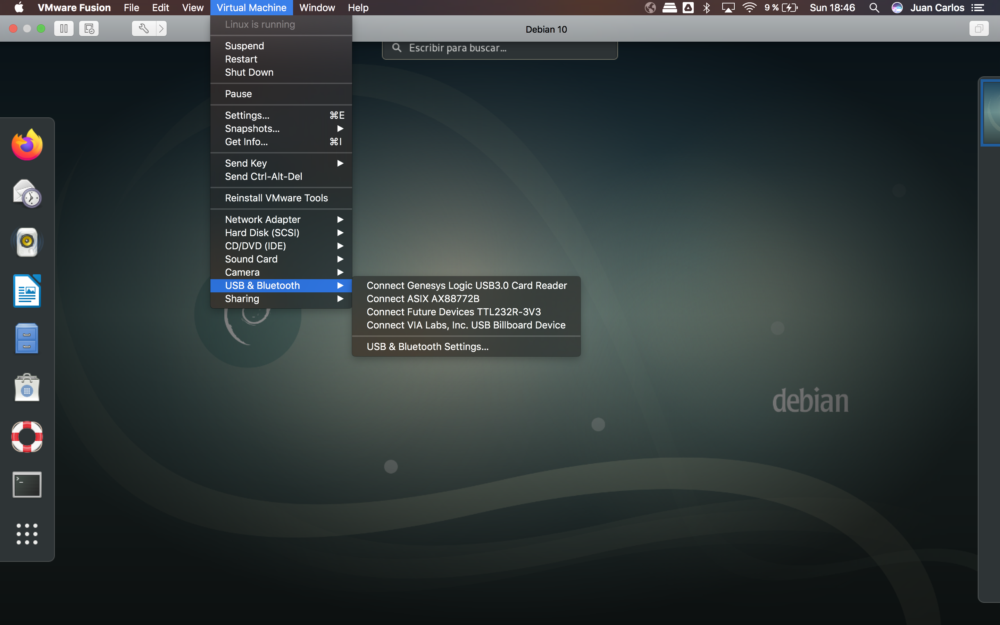
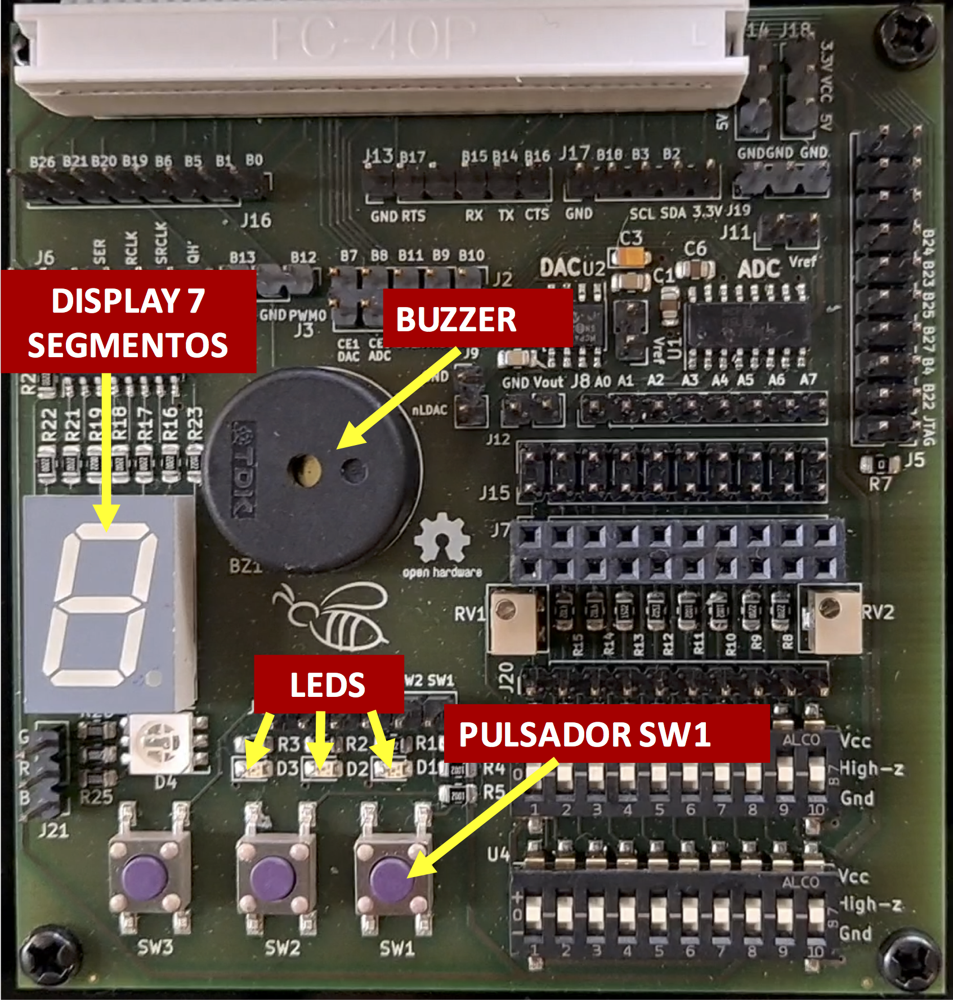

# Drivers en Linux. Preparación del entorno de trabajo

Esta breve guía describe el procedimiento de configuración del sistema formado por la Raspberry Pi (en su variante 3B+ o 4) y la placa de entrada salida Bee v2.0, para la realización de prácticas sobre desarrollo de Drivers en Linux. Esencialmente, para preparar este entorno de prácticas deben realizarse los siguientes pasos:

1. Configuración hardware de placa de entrada-salida ("Bee v2.0") para realización de prácticas
2. Configuración inicial de la máquina virtual y de la red interna para conexión con la Raspberry Pi
3. Arranque por primera vez de la Raspberry Pi usando imagen *custom* preparada para las prácticas
4. Prueba de conexión por SSH a la Raspberry Pi desde la máquina virtual
5. Comprobación del funcionamiento de la placa de E/S y de su configuración
6. Análisis de alternativas para desarrollo en la Raspberry Pi desde la máquina virtual. Configuración de VSCode.

Además del equipo con la máquina virtual instalada, y de la Raspberry Pi conectada a la placa de E/S, se requiere disponer del siguiente material para la realización de los distintos pasos:

* **Scripts de comprobación de conexiones de la placa Bee**:  Se encuentran en el directorio `TestBee` de los [ficheros de ejemplo proporcionados con la primera práctica de drivers](/linux-kernel/src/drivers.tgz).

* **Tarjeta SD de al menos 16GB**: En esta tarjeta se ha de instalar una imagen *custom* de Raspberry Pi OS. El fichero de imagen (`raspberry-pi-os_030422.img`) puede descargarse usando [este enlace de Google Drive](https://drive.google.com/file/d/1xv1LIroXElqzWMXwHLi-MlGTQ3s2ul50/view?usp=sharing). Para la instalación/restauración de la imagen puede emplearse  la aplicación gratuita multiplataforma **balenaEtcher** que puede descargarse [aquí](https://www.balena.io/etcher/). La instalación de la imagen es un proceso muy sencillo. Basta seleccionar el fichero de imagen descargado previamente en nuestro equipo (fichero `raspberry-pi-os_030422.img` ) , escoger la unidad de la tarjeta SD de 16GB donde instalar la imagen (accesible mediante un lector de tarjetas SD), y finalmente hacer clic en Flash.

* **Cable USB TTL**

* **Interfaz USB Ethernet**

* **Cable Ethernet**

* **7 cables dupont hembra-hembra**

* **Dos *jumpers*** (o en su defecto dos cables dupont hembra-hembra adicionales para interconectar 4 pines de la placa Bee v2.0)

  

## Configuración hardware de placa de entrada-salida ("Bee v2.0") para realización de prácticas

La placa de E/S Bee v2.0 que se utilizará en las prácticas de desarrollo de drivers consta de una serie de circuitos desacoplados para la gestión de distintos dispositivos como LEDs, pulsadores, un zumbador (*buzzer*) pasivo, etc. Antes de proceder a arrancar la Raspberry Pi usando la imagen del sistema operativo instalado en la tarjeta SD es preciso realizar distintas conexiones entre pines específicos de la placa (GPIOs) y los pines de entrada o salida de los circuitos que controlan los distintos dispositivos a utilizar. Asimismo, es necesario conectar el cable USB TTL para poder visualizar la salida del puerto serie de la placa desde la máquina virtual de Debian.

La siguiente figura muestra los módulos de pines (J3, J4, J5, J6, J13 y J17) donde se realizarán las conexiones necesarias usando 7 cables dupont hembra-hembra y 2 *jumpers* (o, dos cables dupont extra, si no se dispone de *jumpers*).

  


El siguiente video ilustra cómo realizar las interconexiones de los pines que se requieren para las prácticas:

<iframe src="https://drive.google.com/file/d/15ktZ1ywU0-Q7tUWz2CO8PlWbR1fuHqgf/preview" allowfullscreen="true" width="700" height="394"></iframe>

## Configuración inicial de la máquina virtual y de la red interna 

En este paso procederemos a arrancar la máquina virtual de Debian VMWare, y realizaremos la configuración mínima necesaria para poder conectarnos a la Raspberry Pi desde la máquina virtual de distintas formas.

Tras finalizar el proceso de arranque iniciaremos sesión con el usuario `kernel` y contraseña `kernel`. 

Recordad que la cuenta de usuario tiene "permisos de `sudo`". Para ejecutar un comando como _root_, cuando sea preciso, se ha de hacer lo siguiente:

```bash
sudo <comando>
```

y teclear la contraseña del usuario en cuestión (no la de *root*) cuando la solicite.

Para abrir un _shell_ de root, debemos usar el siguiente comando:

```bash
sudo -i
```


### Conexión de dispositivos USB a la máquina virtual

Para poder acceder vía Ethernet y vía puerto serie a la Raspberry Pi desde la máquina virtual, es preciso ahora conectar la interfaz Ethernet USB y el cable USB TTL a nuestro equipo. La interfaz Ethernet debe estar conectada usando un cable Ethernet a la Raspberry Pi, y el cable USB TTL también debe estar conectado a la placa tal y como se mostró en el video descriptivo.

Al conectar ambos dispositivos USB a nuestro equipo, los dispositivos deberían listarse correctamente en la entrada de menú "USB & Bluetooth" de VMWare, tal y como se muestra en la siguiente imagen:




En la captura de pantalla, la interfaz Ethernet conectada figura como "ASIX AX88772B" (el modelo de la interfaz proporcionado con el material de laboratorios podría ser diferente), y el cable USB TTL como "Future Devices TTL232R-3V3". Para que la máquina virtual tenga el control de ambos dispositivos es necesario hacer clic en la entrada de menú con etiqueta "Connect ..." para los dos dispositivos. Al hacer esto, el menú "USB & Bluetooth" debería mostrar ahora la etiqueta "Disconnect ..." para ambos dispositivos:


Procederemos ahora a comprobar si el dispositivo `/dev/ttyUSB0` está presente, lo cual indicará que el cable USB TTL ha sido reconocido adecuadamente por el sistema Debian. Para ello, abriremos una ventana de terminal dentro de la máquina virtual y ejecutaremos el siguiente comando:

```bash
kernel@debian:~$ ls -l /dev/ttyUSB0
crw-rw---- 1 root dialout 188, 0 abr  3 18:47 /dev/ttyUSB0
```


Para verificar que la interfaz de red USB se ha reconocido correctamente ejecutaremos el comando `ip a` , que debería listar tres interfaces de red: loopback (`lo`), la interfaz ethernet de la propia máquina virtual (`ens33`) y, en último lugar, la interfaz USB Ethernet:

```bash
kernel@debian:~$ ip a
1: lo: <LOOPBACK,UP,LOWER_UP> mtu 65536 qdisc noqueue state UNKNOWN group default qlen 1000
    link/loopback 00:00:00:00:00:00 brd 00:00:00:00:00:00
    inet 127.0.0.1/8 scope host lo
       valid_lft forever preferred_lft forever
    inet6 ::1/128 scope host 
       valid_lft forever preferred_lft forever
2: ens33: <BROADCAST,MULTICAST,UP,LOWER_UP> mtu 1500 qdisc pfifo_fast state UP group default qlen 1000
    link/ether 00:0c:29:c4:71:56 brd ff:ff:ff:ff:ff:ff
    inet 192.168.127.131/24 brd 192.168.127.255 scope global dynamic noprefixroute ens33
       valid_lft 1624sec preferred_lft 1624sec
    inet6 fe80::20c:29ff:fec4:7156/64 scope link noprefixroute 
       valid_lft forever preferred_lft forever
3: enx00001b3c0049: <NO-CARRIER,BROADCAST,MULTICAST,UP> mtu 1500 qdisc pfifo_fast state DOWN group default qlen 1000
    link/ether 00:00:1b:3c:00:49 brd ff:ff:ff:ff:ff:ff
```

Llegados a este punto es crucial anotar el nombre asignado por Linux para la interfaz USB Ethernet conectada a nuestro equipo, ya que este nombre deberá almacenarse en dos ficheros que editaremos a continuación. Esto es preciso para configurar correctamente la red interna, por donde estableceremos comunicación con la Raspberry Pi. En particular, es preciso realizar lo siguiente:

- Reemplazar los ficheros `/usr/local/bin/setup-network.sh` y `/etc/hosts` con la versión de los mismos que se encuentra [aquí](https://jcsaezal.github.io/lin-ucm-docs/code/fixed-files.tgz). Para ello se pueden ejecutar los siguientes comandos:

   ```bash
   # Crear directorio temporal para almacenar los ficheros
   kernel@debian:~$ mkdir /tmp/new
   kernel@debian:~$ cd /tmp/new
   
   # Descargar ficheros en directorio temporal con wget
   kernel@debian:/tmp/new$ wget https://jcsaezal.github.io/lin-ucm-docs/code/fixed-files.tgz
    wget https://jcsaezal.github.io/lin-ucm-docs/code/fixed-files.tgz
   --2024-10-25 16:08:19--  https://jcsaezal.github.io/lin-ucm-docs/code/fixed-files.tgz
   Resolviendo jcsaezal.github.io (jcsaezal.github.io)... 185.199.111.153, 185.199.109.153, 185.199.108.153, ...
   Conectando con jcsaezal.github.io (jcsaezal.github.io)[185.199.111.153]:443... conectado.
   Petición HTTP enviada, esperando respuesta... 200 OK
   Longitud: 1293 (1,3K) [application/octet-stream]
   Grabando a: «fixed-files.tgz»
   
   fixed-files.tgz     100%[===================>]   1,26K  --.-KB/s    en 0s      
   
   2024-10-25 16:08:19 (97,2 MB/s) - «fixed-files.tgz» guardado [1293/1293]
   
   kernel@debian:/tmp/new$ tar xzvf fixed-files.tgz
   ./._copy_files.sh
   copy_files.sh
   ./._hosts
   hosts
   ./._setup-network.sh
   setup-network.sh
   
   # Reemplazar ficheros necesarios usando el script que se proporciona (Introducir contraseña usuario kernel si la solicita)
   
   kernel@debian:/tmp/new$ ./copy_files.sh
   
   
   ```

- Efectuar las siguientes modificaciones en el  fichero `/etc/network/interfaces` como *root* (p.ej.: `sudo nano /etc/network/interfaces` )

  * Descomentar las 4 últimas líneas del fichero, eliminando el símbolo "#" al principio de las 4 líneas:

  	```python
  	#auto enx00001b3c0049
  	#iface enx00001b3c0049 inet static
  	#address 192.168.2.1
  	#netmask 255.255.255.0
  	```

  * Tras descomentar estas líneas, se ha de establecer el nombre asignado a la interfaz USB Ethernet en nuestro sistema en las dos primeras líneas de ese fragmento de texto. Así, por ejemplo, si el nombre de la interfaz USB Ethernet mostrado por `ip a` fuese "enx00001b3c7740", las últimas 4 líneas del fichero `/etc/network/interfaces` deberían ser las siguientes:

  	```
  	auto enx00001b3c7740
  	iface enx00001b3c7740 inet static
  	address 192.168.2.1
  	netmask 255.255.255.0
  	```

- Editar el script ` /usr/local/bin/setup-network.sh` como *root* (p.ej.: `sudo nano /usr/local/bin/setup-network.sh` ) 

  * Modificar la primera línea del fichero (definición de variable `ifname`) para establecer correctamente el nombre de la interfaz USB Ethernet de nuestro equipo. Así por ejemplo, si  el nombre de la interfaz USB Ethernet fuese "enx00001b3c7740", el contenido del fichero ` /usr/local/bin/setup-network.sh` debería quedar de la siguiente forma:

  	```bash
  	#!/bin/bash
  	ifname="enx00001b3c7740"  
  	service networking restart
  	iptables -A FORWARD --in-interface ${ifname}  -j ACCEPT
  	iptables --table nat -A POSTROUTING --out-interface ens33 -j MASQUERADE
  	iptables -I DOCKER-USER -o ${ifname} -i ens33 -j ACCEPT
  	sysctl -w net.ipv4.ip_forward=1
  	```

Tras llevar a cabo estas modificaciones en los ficheros, procederemos a configurar la red interna ejecutando el script `setup-network.sh` con `sudo`:

```bash
kernel@debian:~$ sudo setup-network.sh
net.ipv4.ip_forward = 1
```

**Nota importante**: Para establecer correctamente la configuración de la red interna, este script deberá ejecutarse manualmente siempre que se reinicie la máquina virtual (MV) de Debian, y siempre asegurándonos que la interfaz USB Ethernet está conectada a la MV.


## Primer arranque de la Raspberry Pi

Si se han realizado correctamente todos los pasos hasta este punto, la máquina virtual debería está correctamente configurada, incluyendo la red interna para conexión con la Raspberry Pi. Procederemos entonces a iniciar una sesión serie con la Raspberry Pi (no arrancar aún) desde la máquina virtual, usando el programa `minicom` de la siguiente forma:

```bash
$ sudo minicom ttyUSB0 
```

Esto abrirá la sesión serie de minicom:

  ```bash
  Welcome to minicom 2.7.1
  
  OPCIONES: I18n 
  Compilado en May  6 2018, 08:02:47.
  Port /dev/ttyUSB0, 18:47:08
  
  Presione CTRL-A Z para obtener ayuda sobre teclas especiales
  
  
  
  
  
  
  
  
  
  ```

En este preciso instante, arrancaremos la Raspberry Pi, y visualizaremos el proceso de arranque por la sesión serie de minicom. Nótese que el primer arranque de la placa puede tardar más de lo habitual (algunos minutos), ya que el sistema de ficheros de la partición raíz en la tarjeta SD está configurado para expandirse durante este primer arranque. Acabado el proceso de arranque, se mostrará el *prompt* de login a través del puerto serie:

```bash
  [  OK  ] Started triggerhappy global hotkey daemon.
  [  OK  ] Finished Check for glamor.
  [  OK  ] Finished Check for v3d driver.
  [  OK  ] Finished Remove Stale Onli…ext4 Metadata Check Snapshots.
  [  OK  ] Started System Logging Service.
  [  OK  ] Finished dphys-swapfile - …mount, and delete a swap file.
  [  OK  ] Started LSB: rng-tools (Debian variant).
  [  OK  ] Started User Login Management.
  [  OK  ] Started Avahi mDNS/DNS-SD Stack.
  [  OK  ] Started WPA supplicant.
           Starting Authorization Manager...
  [  OK  ] Finished Raise network interfaces.
  [  OK  ] Reached target Network.
           Starting CUPS Scheduler...
           Starting /etc/rc.local Compatibility...
           Starting OpenBSD Secure Shell server...
           Starting Permit User Sessions...
  My IP address is 192.168.2.20 
  [  OK  ] Started VNC Server in Service Mode daemon.
  [  OK  ] Started /etc/rc.local Compatibility.
  [  OK  ] Finished Permit User Sessions.
           Starting Light Display Manager...
           Starting Hold until boot process finishes up...
  [  OK  ] Started LSB: Switch to ond…(unless shift key is pressed).
  [  OK  ] Started Authorization Manager.
  [  OK  ] Started OpenBSD Secure Shell server.
  
  Raspbian GNU/Linux 11 raspberrypi ttyS0
  
  raspberrypi login: 
  
  CTRL-A Z for help | 115200 8N1 | NOR | Minicom 2.7.1 | VT102 | Desconectado | ttyUSB0  
```

Opcionalmente en este paso se puede realizar login (si se desea) a través del puerto serie utlizando las siguientes credenciales:

* nombre de usuario: `pi`
* Contraseña: `raspberry`

## Prueba de conexión por SSH a la Raspberry Pi desde la máquina virtual

Considerando que la configuración de red se ha realizado correctamente, la Raspberry Pi debería ser accesible por SSH desde la máquina virtual utilizando la dirección IP estática 192.198.2.20, o alternativamente el nombre de host `pi`, que figura en el fichero `/etc/hosts` de la máquina virtual. A continuación se muestra el resultado de acceder por SSH a la Raspberry Pi la primera vez desde la máquina virtual (usuario: "pi", contraseña: "raspberry"):

  ```bash
  kernel@debian:~$ ssh pi@pi
  The authenticity of host 'pi (192.168.2.20)' can't be established.
  ECDSA key fingerprint is SHA256:w+zPKbk0eA66xKatEQMe/Hr70SST88LrvHlsF7CfiQE.
  Are you sure you want to continue connecting (yes/no)? yes
  Warning: Permanently added 'pi,192.168.2.20' (ECDSA) to the list of known hosts.
  pi@pi's password: 
  Linux raspberrypi 5.10.92-v7+ #1514 SMP Mon Jan 17 17:36:39 GMT 2022 armv7l
  
  The programs included with the Debian GNU/Linux system are free software;
  the exact distribution terms for each program are described in the
  individual files in /usr/share/doc/*/copyright.
  
  Debian GNU/Linux comes with ABSOLUTELY NO WARRANTY, to the extent
  permitted by applicable law.
  Last login: Sun Oct  2 21:15:07 2022
  
  SSH is enabled and the default password for the 'pi' user has not been changed.
  This is a security risk - please login as the 'pi' user and type 'passwd' to set a new password.
  
  
  Wi-Fi is currently blocked by rfkill.
  Use raspi-config to set the country before use.
  
  pi@raspberrypi:~ $ 
  
  ```

Para garantizar que la configuración de red es completamente funcional, comprobaremos que la Raspberry Pi tiene acceso a Internet, ejecutando el siguiente comando (a cancelar manualmente con CTRL+C):

```bash
  pi@raspberrypi:~ $ ping www.google.es
  PING www.google.es (142.250.201.67) 56(84) bytes of data.
  64 bytes from mad07s25-in-f3.1e100.net (142.250.201.67): icmp_seq=2 ttl=127 time=7.62 ms
  64 bytes from mad07s25-in-f3.1e100.net (142.250.201.67): icmp_seq=3 ttl=127 time=8.10 ms
  64 bytes from mad07s25-in-f3.1e100.net (142.250.201.67): icmp_seq=4 ttl=127 time=9.16 ms
  64 bytes from mad07s25-in-f3.1e100.net (142.250.201.67): icmp_seq=5 ttl=127 time=11.0 ms
  64 bytes from mad07s25-in-f3.1e100.net (142.250.201.67): icmp_seq=6 ttl=127 time=12.1 ms
  ^C
  --- www.google.es ping statistics ---
  6 packets transmitted, 5 received, 16.6667% packet loss, time 5051ms
  rtt min/avg/max/mdev = 7.615/9.594/12.143/1.713 ms
  pi@raspberrypi:~ $ 
```


## Comprobación del funcionamiento de la placa de E/S y de su configuración

Concluiremos la preparación del entorno de trabajo comprobando que las conexiones realizadas en la placa Bee v2.0 (punto 1 de esta guía), son correctas, y que por tanto,  los dispositivos correspondientes que se usarán en las prácticas (ver imagen a continuación) son completamente funcionales. 





Para realizar las comprobaciones pertinentes es preciso haber descargado primero los  [ficheros de la primera práctica sobre *drivers*](/linux-kernel/src/drivers.tgz). Los comandos que se muestran a continuación asumen que el fichero TAR.GZ correspondiente se ha extraído en el directorio HOME del usuario `kernel`, por lo que existirá un directorio `TestBee` en su interior, donde podrán encontrarse cuatro scripts:

```bash
pi@raspberrypi:~ $ cd TestBee/
pi@raspberrypi:~/TestBee $ ls
7sdisplay_test.py		button_test.py  buzzer_test.sh  leds_test.py
```

Estos scripts permiten controlar el estado del display 7 segmentos de la placa, modificar el estado de los LEDS D1-D3, reproducir notas musicales con el buzzer pasivo, y comprobar si el pulsador SW1 está o no pulsado, todo ello desde espacio de usuario. Cabe destacar que en las prácticas de este curso nos centraremos en el acceso a estos dispositivos desde el kernel Linux. Por lo tanto, se deja como ejercicio el estudio del código de los scripts proporcionados, donde se accede a todos estos dispositivos desde espacio de usuario.

Comenzaremos ejecutando el script `./leds_test.py`. Si las conexiones se han realizado correctamente, el script encenderá y apagará alternativamente los tres LEDs de la placa Bee (D1, D2 y D3). La ejecución del script tendrá que cancelarse manualmente con CTRL+C, tras comprobar que los LEDs se apagan y enciencen alternativamente:

```bash
pi@raspberrypi:~/TestBee $ ./leds_test.py
^CTraceback (most recent call last):
  File "/home/pi/TestBee/./leds_test.py", line 20, in <module>
    time.sleep(0.5)
KeyboardInterrupt
```


En segundo lugar probaremos el funcionamiento del pulsador SW1, que se encuentra debajo de los LEDs. El script `./button_test.py` muestra periodicamente el estado del circuito del pulsador SW1, imprimiendo "Closed" cuando el pulsador no esté pulsado, y "Open" al mantener presionado el pulsador. De nuevo, la ejecución del script ha de interrumpirse manualmente con CTRL+C al finalizar la prueba:

```bash
pi@raspberrypi:~/TestBee $ ./button_test.py 
Closed
Closed
Closed
Closed
Closed
Closed
Closed
Closed
Closed
Closed
Closed
Closed
Closed
Open
Open
Open
Open
Open
Open
Open
Open
Open
Closed
Closed
Closed
Closed
Open
Open
Open
Open
Open
Open
Closed
Closed
Closed
Closed
Closed
Closed
^CTraceback (most recent call last):
  File "/home/pi/TestBee/./button_test.py", line 17, in <module>
    time.sleep(0.2)
```


Probaremos ahora el display 7 segmentos mediante el script `7sdisplay_test.py`. Si las conexiones se han realizado correctamente, el script mostrará continuamente la secuencia hexadecimal de números 0,1,2,..., F. La ejecución del script tendrá que cancelarse tecleando CTRL+C:

```bash
pi@raspberrypi:~/Code/TestBee $ ./7sdisplay_test.py 
========================================
|           LEDs with 74HC595          |
|                                      |
|       Control LEDs with 74HC595      |
|                                      |
========================================

Program is running...
Please press Ctrl+C to end the program...
^Cpi@raspberrypi:~/Code/TestBee $ 
```


Finalmente, se comprobará el funcionamiento del *buzzer* pasivo, mediante el script `buzzer_test.sh`. Este script configura el *buzzer* para la reproducción de la siguiente secuencia de notas: LA4, MI4 y LA4 (cada una de ellas durante un segundo). Este script, a diferencia de los anteriores, ha de ejecutarse con `sudo`:

```bash
pi@raspberrypi:~/TestBee $ sudo ./buzzer_test.sh 
Exporting PWM0 channel
Testing Passive Buzzer
A4 .. E4 .. A4
Done
Unexporting PWM0 channel
```


## Análisis de alternativas para desarrollo en la Raspberry Pi desde la máquina virtual. Configuración de VSCode.

Por motivos de rendimiento se aconseja almacenar en el directorio HOME del usuario `pi` --en la propia Raspberry Pi (tarjeta SD)-- los ficheros fuente de los módulos del kernel a desarrollar en las prácticas. También es recomendable hacer copia de seguridad de los ficheros cada cierto tiempo transfiriéndolos al sistema host  por red (p.ej., usando comando `scp` visto en clase). En este caso, usaremos el término "*host*" para referirnos a la máquina virtual de Debian, que es desde donde nos comunicaremos por red con la placa Raspberry Pi.

Conectarse a la placa por SSH desde la máquina virtual será algo muy frecuente durante la realización de las prácticas. Por este motivo, se aconseja configurar el acceso a la Raspberry Pi sin contraseña, es decir usando una clave SSH. Para establecer la configuración han de seguirse los siguientes pasos dentro de la máquina virtual:

1. Si el fichero `~/.ssh/id_rsa.pub` no existe, ha de crearse uno mediante el comando `ssh-keygen -t rsa -b 2048`. En nuestro caso teclearemos ENTER a continuación para aceptar la ruta por defecto del fichero, y NO establecer *passphrase*: 

	```bash
	kernel@debian:~$ ssh-keygen -t rsa -b 2048
	Generating public/private rsa key pair.
	Enter file in which to save the key (/home/kernel/.ssh/id_rsa): 
	Enter passphrase (empty for no passphrase): 
	Enter same passphrase again: 
	Your identification has been saved in /home/kernel/.ssh/id_rsa.
	Your public key has been saved in /home/kernel/.ssh/id_rsa.pub.
	The key fingerprint is:
	SHA256:6IdQ3RHxf8QeyZRmCgN1j2l7u5v/Dx18VPLjmxamRy8 kernel@debian
	The key's randomart image is:
	+---[RSA 2048]----+
	|         .*+ ...o|
	|       . . =. *Bo|
	|      . . . +++*=|
	|     . .    .o++o|
	|    . . S    ..O+|
	|     o .      =oO|
	|      o .    .E*o|
	|       .      ooo|
	|               +O|
	+----[SHA256]-----+
	
	```

2. Dar de alta la clave SSH generada en el registro del usuario `pi` dentro de la Raspberry Pi. Para ello haremos uso del comando `ssh-copy-id` como se muestra a continuación, y tecleando la contraseña del usuario (`raspberry`) cuando nos lo solicite:

	```bash
	kernel@debian:~$ ssh-copy-id pi@pi
	/usr/bin/ssh-copy-id: INFO: attempting to log in with the new key(s), to filter out any that are already installed
	/usr/bin/ssh-copy-id: INFO: 1 key(s) remain to be installed -- if you are prompted now it is to install the new keys
	pi@pi's password: 
	
	Number of key(s) added: 1
	
	Now try logging into the machine, with:   "ssh 'pi@pi'"
	and check to make sure that only the key(s) you wanted were added.
	```

3. Llegados a este punto ya podremos conectarnos por SSH a la Raspberry Pi sin teclear la contraseña, y usando por debajo la clave SSH generada:

	```bash
	kernel@debian:~$ ssh pi@pi
	Linux raspberrypi 5.10.92-v7+ #1514 SMP Mon Jan 17 17:36:39 GMT 2022 armv7l
	
	The programs included with the Debian GNU/Linux system are free software;
	the exact distribution terms for each program are described in the
	individual files in /usr/share/doc/*/copyright.
	
	Debian GNU/Linux comes with ABSOLUTELY NO WARRANTY, to the extent
	permitted by applicable law.
	Last login: Sat Sep 24 18:07:44 2022 from 192.168.2.1
	
	SSH is enabled and the default password for the 'pi' user has not been changed.
	This is a security risk - please login as the 'pi' user and type 'passwd' to set a new password.
	
	
	Wi-Fi is currently blocked by rfkill.
	Use raspi-config to set the country before use.
	
	pi@raspberrypi:~ $ 
	```

	

Existen esencialmente tres alternativas para desarrollar las prácticas sobre la Raspberry Pi, compilando los módulos del kernel desde la propia placa^[También es posible almacenar, editar los ficheros, y compilar los módulos desde el sistema _host_, empleando compilación cruzada. Sin embargo esto conlleva copiar los .ko correspondientes a la placa para testear su funcionalidad.]. A continuación se describen las distintas opciones.

### Opción 1: Ejecución del editor en la propia placa

Editar los ficheros con programa editor instalado en la propia placa, lanzando el editor por SSH. Pueden utilizarse para ello editores de línea de comandos (como `vim` o `nano`) o incluso editores gráficos como `geany` (esto exige activar la opción `-X` al conectarse por SSH: `ssh -X pi@pi`). La compilación debe llevarse a cabo desde un shell SSH dentro de la propia Raspberry Pi.

### Opción 2: SSHFS y edición de ficheros desde el _host_

El sistema de ficheros de la Raspberry Pi se puede montar en el _host_ (máquina virtual de Debian) por SSH usando el comando `sshfs`, como en el siguiente ejemplo:

```
kernel@debian:~$ mkdir home-raspberry
kernel@debian:~$ sshfs pi@pi:/home/pi home-raspberry
kernel@debian:~$ ls home-raspberry/
Bookshelf  Desktop    Downloads   Pictures   Videos
Documents  Music      Public    Templates

```

En el ejemplo se crea un directorio vacío `home-raspberry` (puede usarse el nombre que se desee), que se emplea como punto de montaje. Gracias al comando `sshfs` del ejemplo se monta el directorio `HOME` del usuario `pi` de la Raspberry en el directorio `~/home-raspberry` del _host_. Una vez montada la carpeta por SSH se pueden editar los ficheros con cualquier editor en el host, ya sea por línea de comandos o gráficamente (p.ej., con Sublime Text o VSCode). SSHFS transfiere automáticamente los ficheros a la Raspberry cuando detecta cambios en los mismos, y sin requerir intervención del usuario. 

Cuando se haya acabado de trabajar con los ficheros, o cuando se desee reiniciar o apagar la Raspberry Pi, se ha de desmontar la carpeta montada usando `fusermount`: 

```bash
kernel@debian:~$ fusermount -u home-raspberry
kernel@debian:~$ 
```


### Opción 3: Uso de extensión *Remote* de VSCode para trabajar con Raspberry Pi de forma transparente

VSCode posee una extensión llamada *Remote* que permite trabajar con una o varias carpetas de un sistema accesible por SSH^[Este *plugin* de VSCode también soporta trabajar con WSL y contenedores Docker.] como si de una carpeta local se tratara. Una vez se ha establecido la conexión de VSCode con el sistema remoto, los terminales abiertos dentro del propio entorno se ejecutarán en la máquina a la que nos hemos conectado. Por lo tanto, cada terminal se corresponde con un shell SSH en la máquina *target* (la Raspberry Pi en nuestro caso). En definitiva, de esta forma tendremos la ilusión de que trabajamos con VSCode desde dentro del propio sistema *target*, pero usando el entorno gráfico del *host* de desarrollo.

La extensión _Remote_ ya está instalada en la máquina virtual del laboratorio. No obstante, hemos de configurar dicha extensión para trabajar con la Raspberry Pi. Para ilustrar el proceso de configuración de *Remote* desde la máquina virtual se proporciona el vídeo mostrado a continuación. En el vídeo se asume que se ha habilitado el acceso por SSH sin contraseña (vía clave SSH) a la Raspberry Pi siguiendo las instrucciones mostradas más arriba.


<iframe src="https://drive.google.com/file/d/1rOSmB5T_ykGrL1aEHnFy2OjiLgomgwxa/preview" allowfullscreen="true" width="700" height="394"></iframe>
Una vez que la Raspberry Pi se ha dado de alta como *remote* dentro de VSCode --como se ilustra en el vídeo--, dicho remote permanecerá registrado en futuras ejecuciones de VSCode. Por lo tanto, para trabajar con ficheros en la placa bastará abrir la carpeta deseada desde el explorador de *Remotes*.

Por último, se ha de tener presente que cuando hacemos uso de la extensión *Remote*, es necesario instalar las extensiones de VSCode que deseemos para desarrollar desde ese *target* al que nos conectamos. Para trabajar con la Raspberry Pi, se recomienda instalar las extensiones estándar de VSCode para desarollo C/C++. La instalación debe hacerse desde una ventana de Remote. 

