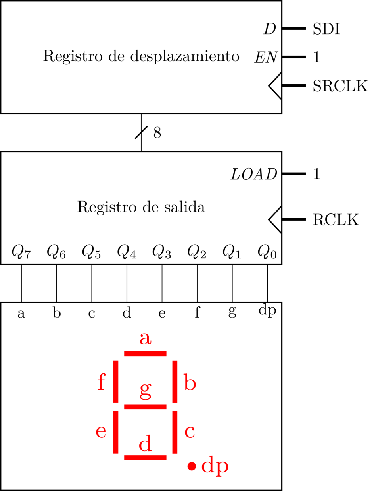

# Drivers en Linux. Aspectos básicos y GPIO


## Objetivos

Los principales objetivos de esta práctica son los siguientes:

1. Familiarizarse con las principales estructuras y abstracciones que se emplean en la implementación de drivers de dispositivos de caracteres en Linux.
2. Introducirse en el uso de la *descriptor* API para el sistema GPIO en Linux
3. Aprender a gestionar los LEDs y el display 7 segmentos de la placa Bee v2.0 desde el kernel Linux.

El código para esta práctica puede descargarse [aquí](/linux-kernel/src/drivers.tgz).

Se recomienda al estudiante seguir un orden particular al desarrollar la práctica. Los pasos recomendados son los siguientes:

1. Seguir el tutorial de [preparación del entorno de prácticas](/linux-kernel/config) con la Raspberry Pi, la placa de E/S y la máquina virtual de Debian

4. Realizar los ejercicios 1-6 de este guión, que se centran en ilustrar el funcionamiento de los drivers de dispositivos de caracteres y la API de GPIO en Linux.

5. Desarrollar el módulo del kernel solicitado en la Parte A de la práctica.

6. Realizar el ejercicio 7 del guión, que ilustra el funcionamiento a bajo nivel del display 7 segmentos de la placa Bee v2.0.

7. Desarrollar la [Parte B](#parteC) de la práctica, en la que será preciso modificar el módulo del kernel proporcionado en el ejercicio 7


**Teoría de la práctica**

La teoría asociada a esta práctica se imparte en la asignatura "Arquitectura Interna de Linux y Android", ofertada en las distintas titulaciones de grado en la Facultad de Informática de la Universidad Complutense de Madrid. Para más información sobre la asignatura consultad a [Juan Carlos Sáez Alcaide](mailto:jcsaezal@ucm.es).

Para documentarse sobre la temática de forma autónoma se proporcionan las siguientes referencias:

* Peter Jay Salzman, Michael Burian, Ori Pomerantz, Bob Mottram, Jim Huang. *Linux Kernel Module Programming Guide*. 2025. [Disponible online](https://sysprog21.github.io/lkmpg/). Versión en [PDF](Peter Jay Salzman, Michael Burian, Ori Pomerantz, Bob Mottram, Jim Huang)
* Kaiwan N. Billimoria. *Linux Kernel Programming*. Packt Publishing. 1st edition. 2021
* Kaiwan N. Billimoria. *Linux Kernel Programming. Part 2 - Char Device Drivers and Kernel Synchronization*. Packt Publishing. 1st edition. 2021
* Robert Love; _Linux Kernel Development_. Addison Wesley, 3rd Edition. Julio 2010


## Ejercicios


### Ejercicio 1

Probar y analizar el código de los módulos de ejemplo `Chardev2` y `ChardevMisc`. Compilar y cargar cada uno de los módulos del kernel y responder a las siguientes preguntas para cada uno de ellos:

1. ¿Cuál es la ruta (*path*) del fichero de dispositivo que se crea automáticamente al cargar el módulo?
2. ¿En qué fichero especial del sistema puede consultarse el major number asignado al driver correspondiente?
3. ¿Qué *minor number* tiene asociado cada uno de los ficheros especiales creados al cargar los módulos del kernel? ¿Qué llamada del driver se encarga de asignar ese *minor number*? 
4. ¿Qué sucede al escribir en el fichero especial de dispositivo (p.ej., `echo hello > /dev/chardev`)? ¿Por que se produce este comportamiento?


### Ejercicio 2

Algunas  funciones de la API del kernel Linux retornan un puntero a una estructura, que representa un objeto del kernel. En algunos casos, como en la función `proc_create()`,  un valor de retorno igual a NULL indica que se ha producido un error. Un valor distinto de NULL refleja que la función se ha ejecutado correctamente, y que por tanto, la estructura devuelta es válida. El problema de esta aproximación a la gestión de errores es que la función invocadora desconoce el error concreto que se ha producido, ya que solo puede saber si ha habido error o no. 

Para ofrecer mayor robustez en la gestión de errores en funciones que retornan un puntero a una estructura, es posible usar el propio puntero retornado para almacenar el código del error que se ha producido usando la macro `ERR_PTR()`. Consulta la implementación de la función `class_create()`  cuya implementación, que puede encontrarse [aquí](https://elixir.bootlin.com/linux/v6.2.16/source/drivers/base/class.c#L231), hace uso de la citada macro. 

Al usar funciones que codifican errores de esta forma es posible comprobar desde la función invocadora si el valor de retorno almacena un código de error usando la macro `IS_ERR()`. Además, en caso de que se haya producido un error la macro `PTR_ERR()` permite recuperar el código (negativo) de error a partir del puntero. Analiza detenidamente el uso de las macros  `IS_ERR()` y  `PTR_ERR()`  en el módulo de ejemplo `Chardev2`.


### Ejercicio 3

El módulo del kernel de ejemplo `ChardevData` constituye una variante de `Chardev2`, donde las variables globales a las que se accede en las operaciones `open()`, `read()` y `release()` se han reemplazado por una estructura privada asociada al `struct device_data` que crea el driver. Consulta la implementación del módulo `ChardevData` y responde a las siguientes preguntas.

1. ¿Qué ventaja crees que tiene reemplazar las citadas variables globales por la estructura privada?
2. ¿Que llamada de la API de Linux permite asociar en esta implementación la estructura privada al al `struct device` que crea el driver?
3. ¿Cómo es posible recuperar dicha estructura privada en las operaciones `open()`, `read()` y `release()`? **Pista:** La estructura `struct file*` que se pasa como parámetro a estas operaciones representa el fichero abierto sobre el que se invocan las operaciones desde espacio de usuario, y su campo `private_data` se utiliza en el driver para almacenar un puntero.


### Ejercicio 4

Analizar la implementación del módulo de ejemplo `Clipboard-dev`. Se trata de una variante del ejemplo `Clipboard` de la práctica 1, donde el "clipboard" se expone usando un fichero especial de caracteres `/dev/clipboard` en lugar de un fichero en `/proc`.  Identifica las diferencias entre la implementación de ambos módulos del kernel: `diff -u <ruta clipboard.c> <ruta clipboard-dev.c>`

En ambos módulos del kernel están presentes las funciones `clipboard_write()` y `clipboard_read()` para gestionar las acciones de lectura y escritura sobre el fichero especial que representa el "clipboard" en cada caso. ¿Qué diferencias encuentras entre la implementación de estas funciones presentes tanto en `Clipboard` como en `Clipboard-dev`?


### Ejercicio 5

En el directorio del módulo de ejemplo Clipboard de la práctica 1 pueden encontrarse dos ficheros de GNU Make: `Makefile` y `Makefile.cross`. El segundo de ellos sirve para realizar compilación cruzada del módulo del kernel para la Raspberry Pi desde nuestro *host* de desarrollo (la máquina virtual de Debian). 

Este ejercicio consiste en realizar una compilación cruzada del módulo del kernel Clipboard para la Raspberry Pi y probar el fichero `.ko` resultante de dicha compilación en la placa.  Para ello han de seguirse los siguientes pasos:

1. Abrir un navegador web en la máquina virtual y descargar el fichero `linux-raspberry.tgz` usando [este enlace](https://drive.google.com/file/d/1ELwo5z1C9x8ophO3eYXfkdZm1X9DdsbQ/view?usp=sharing). El fichero comprimido contiene un kernel Linux ya compilado para la Raspberry Pi, que nos permite realizar compilación cruzada de módulos del kernel.

2. Extraer el fichero comprimido en el `HOME` del usuario `kernel`. (Se asume que el fichero descargado se almacena en `~/Descargas`).

  ```powershell
  $ cd
  $ tar xzvf ./Descargas/linux-raspberry.tgz
  ```

3. Instalar el compilador cruzado (debería encontrarse ya instalado en la máquina virtual):

  ```bash
  $ sudo apt install gcc-8-arm-linux-gnueabihf gcc-arm-linux-gnueabihf
  ```

4. Ir al directorio `Clipboard` y borrar ficheros resultantes de compilaciones previas usando el `Makefile` convencional:

  ```powershell
  kernel@debian:~$ cd FicherosP1/Clipboard
  kernel@debian:~/FicherosP1$ make clean 
  ```

5. Generar el `.ko` adecuado para el kernel de la Raspberry pi usando el comando `make -f Makefile.cross` desde el mismo directorio donde nos encontramos. Nótese que con la opción -f de GNU Make se escoge manualmente el fichero Makefile para realizar la compilación.

6. Finalmente, copiar el fichero `.ko` a la Raspberry Pi usando `scp` y probar dicho módulo en la placa
	
	* Comando de copia del fichero al directorio `HOME` del usuario `pi` en la placa: `scp clipboard.ko pi@pi:.`


### Ejercicio 6

El módulo del kernel `ModledsPi_gpiod` modifica el estado de los LEDs D1, D2 y D3 de la placa Bee v2.0. En particular, al cargar este módulo en la Raspberry Pi, los citados LEDs se encienden; al descargar el módulo, estos LEDs se apagan.

En este ejercicio se plantea analizar la implementación de este módulo, cuyo código deberá reutilizarse para la implementación de la práctica. Para ello se ha de prestar especial atención a la siguiente función:

```C
static inline int set_pi_leds(unsigned int mask) {
  int i;
  for (i = 0; i < NR_GPIO_LEDS; i++)
    gpiod_set_value(gpio_descriptors[i], (mask >> i) & 0x1 );
  return 0;
}
```

La función `set_pi_leds()` acepta como parámetro una máscara de bits que especifica el estado de cada LED. Si el bit correspondiente está a "1", el LED asociado se enciende; si está a "0" se apagará.  La correspondencia entre los bits de la máscara (`unsigned int`) y los LEDs es la siguiente:

* Bit 0: Led D3
* Bit 1: Led D2
* Bit 2: Led D1
* Bits 3-31: Se ignoran


### Ejercicio 7

Estudiar el funcionamiento e implementación del módulo de ejemplo `Misc7seg`, que al igual que el del ejercicio anterior ha sido creado especificamente para la placa de E/S Bee 2.0. Este driver --módulo del kernel--, al cargarse, expone el display 7 segmentos de la placa al usuario mediante el fichero especial de caracteres `/dev/display7s`, perteneciente a la clase `misc` del LDM.  El driver permite alterar el estado del display escribiendo desde espacio de usuario en dicho fichero especial. La implementación, no obstante, ignora la cadena o secuencia de bytes escrita en el fichero de dispositivo con `write()`, y simplemente altera el estado del display encendiendo segmentos específicos siguiendo un patrón determinado. Para averiguar el patrón de encendido de los segmentos, que se realiza en `display7s_write()`, se pueden realizar escrituras con `echo > /dev/display7s` de forma manual, o empleando un bucle infinito (a terminar con CTRL+C) como en el siguiente comando:

```bash
$ while true; do echo > /dev/display7s; sleep 0.4; done
```

Una parte crítica de este ejercicio es comprender cómo el módulo del kernel controla el estado del display 7 segmentos, usando pines específicos de la Raspberry Pi. El display integrado en la placa tiene los 7 segmentos habituales (`a`,`b`,`c`, ...., `g`) y uno extra para el punto --llamado `dp`--. Ya que dedicar 8 pines para controlar estos segmentos limita enormemente el uso simultáneo de otros dispositivos de E/S, la placa Bee v2.0 integra un circuito para controlar el display que solo requiere 3 pines. La siguiente figura muestra un diagrama del circuito:




El circuito consta de 3 módulos fundamentales: un registro de desplazamiento (etapa de entrada), un registro convencional con carga paralela, y el módulo del display 7 segmentos propiamente dicho, que integra los LEDs correspondientes y una serie de resistencias de entrada (no mostradas en el diagrama, por simplicidad). El sistema consta de las siguientes 3 entradas:

* **SDI** (*Serial Data Input*): codifica el bit de entrada serie al registro de desplazamiento
	* Esta entrada se controla con el GPIO 18 de la Raspberry Pi
* **SRCLK** (*Shift Register Clock*): señal de reloj del registro de desplazamiento
	* Esta señal de reloj se controla con el GPIO 23 de la Raspberry Pi
* **RCLK** (*Register Clock*): señal de reloj del registro de salida
	* Esta señal de reloj se controla con el GPIO 24 de la Raspberry Pi

Como podemos observar en el diagrama, las señales de *enable* (EN) del registro de desplazamiento, y de *carga* (LOAD) del registro de salida están a 1, por lo que los módulos realizarán su acción específica --desplazamiento, y carga paralela, respectivamente-- siempre que se produzca un flanco de subida en su señal de reloj correspondiente. 

El estado de los segmentos se representa mediante un número de 8 bits, estando representado el segmento *a* mediante el bit más significativo, y *dp* por el bit menos significativo. Como los LEDs del módulo que implementa el display 7 segmentos están en configuración de *cátodo común*, un bit a 1 enciende el segmento correspondiente, y un 0 lo apaga.

 Intuitivamente, para actualizar el estado del display desde la CPU han de seguirse estos pasos:

1. Asegurarse de que los pines que controlan la señal de reloj **SRCLK** y **RCLK** están a cero al principio del procedimiento  
2. Para cada bit del número de estado (8 bits), recorriendo los bits de izquierda a derecha:
	* Escribir el bit actual en la entrada **SDI** usando el GPIO asociado
	* Generar un pulso de reloj en el registro de desplazamiento con la entrada **SRCLK** modulando la señal ("dibujando el pulso") mediante el pin GPIO correspondiente 
	* **RCLK** estará siempre a cero durante esta etapa.
3. Al final del punto anterior, la entrada paralela del registro de salida ya tiene los bits en el orden deseado ya que se han ido desplazando todos hacia la izquierda. Por lo tanto, basta generar un pulso de reloj en la señal **RCLK**, para cargar el número en el registro. Al hacer esto, se actualizará automáticamente la salida del registro, y por tanto el estado de los segmentos en el display.

La función del driver que implementa el citado procedimiento de actualización del estado del display es `update_7sdisplay()`: 

```C
#define SEGMENT_COUNT 8
static void update_7sdisplay(unsigned char data)
{
	int i = 0;
	int value = 0;

	for (i = 0; i < SEGMENT_COUNT; i++) {
		/* Explore current bit (from most significant to least significant) */
		if (0x80 & (data << i))
			value = 1;
		else
			value = 0;

		/* Set value of serial input */
		gpiod_set_value(gpio_descriptors[SDI_IDX], value);
		/* Generate clock cycle in shift register */
		gpiod_set_value(gpio_descriptors[SRCLK_IDX], 1);
		msleep(1);
		gpiod_set_value(gpio_descriptors[SRCLK_IDX], 0);
	}

	/* Generate clock cycle in output register to update 7-seg display */
	gpiod_set_value(gpio_descriptors[RCLK_IDX], 1);
	msleep(1);
	gpiod_set_value(gpio_descriptors[RCLK_IDX], 0);
}
```


La alteración de las señales SDI, SRCLK y RCLK se realiza mediante *bit banging*, es decir modificando el valor del pin manualmente desde la CPU, pero de forma temporizada, realizando las esperas necesarias para garantizar que la señal se mantenga un cierto tiempo en el valor lógico deseado. En particular, para garantizar que el pulso de reloj tenga una duración mínima garantizada de 1ms, el driver hace uso de la función `msleep()` del kernel, que bloquea al flujo de ejecución invocador durante el periodo de tiempo en ms indicado como argumento.  


## Desarrollo de la práctica

Esta práctica consta de dos partes: A y B 

### Parte A 

Implementar un driver de dispositivo de caracteres `Modleds-dev-pi` que permita establecer el estado de los LEDS D1-D3 de la placa Bee v2.0. Al cargar dicho driver se creará automáticamente un fichero especial de caracteres `/dev/leds` . El estado de los LEDs podrá alterarse escribiendo un número del 0 al 7 (máscara de 3 bits) al fichero especial. La correspondencia entre los bits de esta máscara y los LEDs será la siguiente:

* Bit 2: encender/apagar LED D3
* Bit 1: encender/apagar LED D2
* Bit 0: encender/apagar LED D1

La siguiente tabla muestra algunos ejemplos:

| Número escrito en  `/dev/leds` | D3   | D2   | D1   |
| ------------------------------ | ---- | ---- | ---- |
| 4                              | ON   | OFF  | OFF  |
| 7                              | ON   | ON   | ON   |
| 3                              | OFF  | ON   | ON   |
| 0                              | OFF  | OFF  | OFF  |
| 2                              | OFF  | ON   | OFF  |

Si el usuario escribe una cadena de caracteres que no sea 0-7 la escritura sobre el dispositivo deberá devolver un error:

```bash
$ pi@raspberrypi:~ $ echo 9 > /dev/leds
-bash: echo: write error: Invalid argument
$ pi@raspberrypi:~ $ echo potato > /dev/leds
-bash: echo: write error: Invalid argument
```

Para probar el funcionamiento del driver `Modleds-dev` se aconseja ejecutar el siguiente script BASH, que altera periódicamente el estado de los LEDs para emular un contador binario módulo 7:

```bash
#!/bin/bash

while true
do
   for (( i=0; $i<8 ; i++ ))
   do
      echo $i > /dev/leds
      sleep 0.4
   done
done
```

#### Parte opcional

Modificar el ejemplo `ChardevData` , de tal forma que se creen 3 dispositivos de caracteres independientes al cargar el módulo: `/dev/chardev0`, `/dev/chardev1` y `/dev/chardev2`. Cada uno de estos dispositivos tiene que tener asociado una estructura independiente de tipo `device_data`:

```C
struct device_data {
    int Device_Open; /* Is device open?  Used to prevent multiple access to device */
    char msg[BUF_LEN];   /* The msg the device will give when asked */
    char *msg_Ptr;       /* This will be initialized every time the
                            device is opened successfully */
    int counter;       /* Tracks the number of times the character
                             device has been opened */
    struct device* device;
    dev_t major_minor;
};
```

Al asociar una estructura independiente a cada dispositivo "virtual" de caracteres, cada uno de ellos será completamente independiente de cara al usuario, como se ilustra en el siguiente ejemplo de ejecución:

```bash
## Compilación y carga del módulo modificado
pi@raspberrypi:~/Solutions/ChardevDataMulti $ make
make -C /lib/modules/5.10.92-v7+/build M=/home/pi/Solutions/ChardevDataMulti modules
make[1]: Entering directory '/usr/src/linux-headers-5.10.92-v7+'
  CC [M]  /home/pi/Solutions/ChardevDataMulti/chardev_data.o
  MODPOST /home/pi/Solutions/ChardevDataMulti/Module.symvers
  CC [M]  /home/pi/Solutions/ChardevDataMulti/chardev_data.mod.o
  LD [M]  /home/pi/Solutions/chardev_data.ko
make[1]: Leaving directory '/usr/src/linux-headers-5.10.92-v7+'
pi@raspberrypi:~/Solutions/ChardevDataMulti $ sudo insmod chardev_data.ko 

## Interacción con dispositivos de caracteres independientes
pi@raspberrypi:~/Solutions/ChardevDataMulti $ cd
pi@raspberrypi:~ $ ls /dev/chardev*
/dev/chardev0  /dev/chardev1  /dev/chardev2
pi@raspberrypi:~ $ cat /dev/chardev0
I already told you 0 times Hello world!
pi@raspberrypi:~ $ cat /dev/chardev1
I already told you 0 times Hello world!
pi@raspberrypi:~ $ cat /dev/chardev2
I already told you 0 times Hello world!
pi@raspberrypi:~ $ cat /dev/chardev2
I already told you 1 times Hello world!
pi@raspberrypi:~ $ cat /dev/chardev0
I already told you 1 times Hello world!
```


### Parte B 

Extender la funcionalidad del módulo de ejemplo `Misc7seg` (Ejercicio 7), para que el usuario pueda especificar el dígito hexadecimal (de 0 a F) que se desea mostrar en el display 7 segmentos escribiendo en el fichero especial de caracteres `/dev/display7s`. Para ello se ha de modificar la función `display7s_write()` . También se recomienda definir macros que codifiquen el número de 8 bits que ha de escribirse en el display para representar cada dígito hexadecimal. 

#### Ejemplo de ejecución 

```bash
$ pi@raspberrypi:~ $ echo 9 > /dev/display7s
## Debería mostrar el número 9 en el display

$ pi@raspberrypi:~ $ echo A > /dev/display7s
## Debería mostrar la letra A (número 10) en el display

$ pi@raspberrypi:~ $ echo f > /dev/display7s
## Debería mostrar la letra F (número 15) en el display

## Casos de error
$ pi@raspberrypi:~ $ echo 27 > /dev/display7s
-bash: echo: write error: Invalid argument
$ pi@raspberrypi:~ $ echo h > /dev/display7s
-bash: echo: write error: Invalid argument
$ pi@raspberrypi:~ $ echo potato > /dev/display7s
-bash: echo: write error: Invalid argument
```

