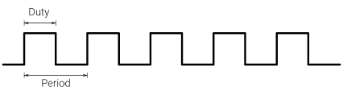

# Drivers en Linux. Gestión de interrupciones, temporizadores, y trabajos diferidos

## Objetivos

El principal objetivo de esta práctica es familiarizarse con la gestión de interrupciones en el kernel Linux, los temporizadores del kernel, y la creación y planificación de tareas diferidas mediante *workqueues*. Como objetivo secundario, se estudiarán los fundamentos sobre generación de señales PWM por hardware en Linux.

El código para esta práctica puede descargarse [aquí](/linux-kernel/src/interrupts.tgz).

Antes de comenzar con los ejercicios de esta práctica es preciso consultar la introducción al uso de PWM por hardware en Linux, que se encuentra en la siguiente sección.

**Teoría de la práctica**

La teoría asociada a esta práctica se imparte en la asignatura "Arquitectura Interna de Linux y Android", ofertada en las distintas titulaciones de grado en la Facultad de Informática de la Universidad Complutense de Madrid. Para más información sobre la asignatura consultad a [Juan Carlos Sáez Alcaide](mailto:jcsaezal@ucm.es).

Para documentarse sobre la temática de forma autónoma se proporcionan las siguientes referencias:

* Peter Jay Salzman, Michael Burian, Ori Pomerantz, Bob Mottram, Jim Huang. *Linux Kernel Module Programming Guide*. 2025. [Disponible online](https://sysprog21.github.io/lkmpg/). Versión en [PDF](Peter Jay Salzman, Michael Burian, Ori Pomerantz, Bob Mottram, Jim Huang)

* Kaiwan N. Billimoria. *Linux Kernel Programming*. Packt Publishing. 1st edition. 2021

* Kaiwan N. Billimoria. *Linux Kernel Programming. Part 2 - Char Device Drivers and Kernel Synchronization*. Packt Publishing. 1st edition. 2021

* Robert Love; _Linux Kernel Development_. Addison Wesley, 3rd Edition. Julio 2010

  

## PWM por hardware en Linux

Una señal PWM (*Pulse Width Modulation*) es una señal digital caracterizada por dos parámetros: el periodo (*period*) y el ciclo de trabajo (*duty cycle*), que pueden ajustarse a lo largo del tiempo. Como se muestra en la siguiente figura, el periodo es el intervalo de tiempo transcurrido entre dos flancos consecutivos de subida (o de bajada), y el *duty cycle* es la fracción de tiempo dentro de un periodo en la que la señal está a "1" .



Este tipo de señales tienen un amplio espectro de aplicaciones, como el control de servomotores y ventiladores, o el ajuste de intensidad de los distintos componentes de color de LEDs RGB. Las señales PWM se pueden generar por software en dispositivos equipados con pines GPIO, mediante *bit banging*, es decir ajustando manualmente la señal de salida de un pin a lo largo del tiempo. Por ejemplo, en el módulo *Misc7seg*  que se distribuye con el material de la Práctica 3 de la asignatura, las señales que gobiernan el display 7 segmentos de la placa --que no son PWM-- se controlan mediante *bit banging*. 

Generar señales PWM mediante *bit banging* tiene asociado un alto consumo de CPU; un *flujo de ejecución* debe dedicarse a generar cada señal a grano fino y controlar de forma precisa el tiempo entre flancos. Además, esta técnica no resulta adecuada para sistemas que no tienen garantías de tiempo real, como la versión *vanilla* del kernel Linux. En este tipo de sistemas nada impide que el código generador de la señal PWM que se ejecuta en una CPU o núcleo específico de la máquina (incluso siendo parte del sistema operativo) pueda ser interrumpido por código más prioritario (p.ej., manejador de una interrupción no enmascarable); en tal caso no es posible garantizar suficiente precisión para imponer un periodo o un duty cycle específico, lo cual puede desencadenar un mal funcionamiento del sistema gobernado por la señal PWM. 

Para solventar este problema existen dispositivos hardware específicos dedicados a la generación de señales PWM, que no requieren la intervención continuada de la CPU. El estudio de la API de Linux para el uso de estos dispositivos es el foco principal de esta introducción.

En Linux hay dos agentes involucrados en el uso del hardware PWM: los *drivers PWM* y los *usuarios PMW* (también llamados PWM *consumers*). Los **drivers PWM** implementan el soporte necesario en Linux para interactuar directamente con el hardware PWM. Para la implementación de estos drivers se emplean las funciones [`pwmchip_add()`](https://elixir.bootlin.com/linux/latest/source/drivers/pwm/core.c#L268) y [`pwmchip_remove()`](https://elixir.bootlin.com/linux/latest/source/drivers/pwm/core.c#L333), que registran y desregistran respectivamente una estructura [`struct pwm_chip`](https://elixir.bootlin.com/linux/latest/source/include/linux/pwm.h#L300). Esta estructura --adecuadamente inicializada por el driver-- describe al kernel las caracteristicas del chip PWM específico (incluyendo el número de canales PWM que soporta), y proporciona una implementación específica del driver para interactuar con el chip PWM en cuestión. Los **usuarios o *consumers* PWM** hacen uso de una interfaz de programación de Linux que garantiza portabilidad, abstrayendo los detalles de bajo nivel asociados a la configuración de un chip PWM específico. Numerosos drivers en Linux actuan como *consumers* de PWM. A continuación se describe la interfaz de programación usada por los consumers PWM, que será necesario utilizar en la práctica. 	

#### Pulse Width Modulation (PWM) Consumer Interface

Para poder usar uno de los canales PWM disponibles en la plataforma es necesario obtener primero un descriptor del dispositivo PWM, representado por el tipo de datos `struct pwm_device*`. Una de las formas más directas para obtener tal descriptor es mediante la función `pwm_request()` declarada en `<linux/pwm.h>`:

```C
 struct pwm_device* pwm_request(int pwm, const char *label);
```

Parámetros:

* `pwm`: Índice global del dispositivo PWM en el sistema
* `label`: Etiqueta descriptiva del dispositivo PWM
	* **Nota:** En la Raspberry Pi, puede usarse cualquier cadena de caracteres arbitraria para este parámetro.

El dispositivo PWM solicitado mediante `pwm_request()` queda reservado  para uso exclusivo del driver (*consumer*) que invocó la llamada. Cuando el dispositivo deje de estar en uso (p.ej., en la función `cleanup()` del módulo del kernel correspondiente), el driver debe liberarlo usando la función `pwm_free()`, que acepta como parámetro el descriptor retornado por `pwm_request()`:

```C
void pwm_free(struct pwm_device *pwm);
```

Para configurar una señal PWM con el dispositivo, el driver ha de crear una variable (local) de tipo `struct pwm_state`, que representa el estado de un canal PWM. La definición y documentación sobre esta estructura se encuentra en `<linux/pwm.h>`:

```C
/*
 * struct pwm_state - state of a PWM channel
 * @period: PWM period (in nanoseconds)
 * @duty_cycle: PWM duty cycle (in nanoseconds)
 * @polarity: PWM polarity
 * @enabled: PWM enabled status
 * @usage_power: If set, the PWM driver is only required to maintain the power
 *               output but has more freedom regarding signal form.
 *               If supported, the signal can be optimized, for example to
 *               improve EMI by phase shifting individual channels.
 */

struct pwm_state {
	u64 period;
	u64 duty_cycle;
	enum pwm_polarity polarity;
	bool enabled;
	bool usage_power;
};
```

El procedimiento de configuración de un canal PWM mediante esta estructura estado conlleva la realización de los siguientes pasos:

1. Almacenamiento del estado actual del canal PWM en la estructura mediante la función `pwm_init_state()`. Esta función acepta como parámetro el descriptor del dispositivo PWM y la estructura cuyos campos se rellenarán con la información actual del estado del canal:

	```C
	void pwm_init_state(const struct pwm_device *pwm, struct pwm_state *state)
	```

2. Modificación manual de los campos de la estructura de estado, según las propiedades de la señal PWM que se desee generar. Habitualmente se modifican los campos `period` (periodo de la señal, especificado en nanosegundos), `duty_cycle` (longitud del pulso del "1" lógico dentro del periodo), y `enabled` (indicador de canal PWM activado). Alternativamente, el valor del campo `duty_cycle` puede establecerse de forma indirecta como fracción sobre el periodo. Para ello ha de emplearse la siguiente función:

	```C
	int pwm_set_relative_duty_cycle(struct pwm_state *state,
	 			unsigned int duty_cycle, unsigned int scale);
	```

	Los parámetros `duty_cycle` y `scale` permiten especificar la fracción de *duty cycle* deseada, como cociente de ambos parámetros. Así, por ejemplo, para establecer un *duty cycle* del 70%, los valores de los citados parámetros pueden establecerse a 70 y 100 respectivamente.

3. Una vez se han establecido los valores deseados en la estructura de estado, se ha de aplicar la configuración al canal PWM usando la función `pwm_apply_state()`:

	```C
	int pwm_apply_state(struct pwm_device *pwm, const struct pwm_state *state);
	```

Finalmente merece la pena mencionar la existencia de las funciones `pwm_enable()` y `pwm_disable()` que permiten respectivamente activar y desactivar la salida emitida por el canal PWM asociado al dispositivo pasado como parámetro:

```C
int pwm_enable(struct pwm_device *pwm);
int pwm_disable(struct pwm_device *pwm);
```

Las funciones PWM descritas en esta sección son las únicas que han de utilizarse para la implementación de la práctica. Para obtener información más extensa sobre éstas u otras llamadas de la API PWM, se puede consultar [la documentación oficial del kernel Linux](https://www.kernel.org/doc/html/latest/driver-api/pwm.html).


## Ejercicios


### Ejercicio 1

Estudiar la implementación del módulo de ejemplo *GPIODInterrupt* analizado en clase. Este módulo del kernel instala un manejador de interrupción que se ejecuta tras pulsar el botón SW1 de la placa Bee.   Cuando se pulsa SW1, se genera una interrupción (controlada por flanco de subida). En respuesta a esta interrupción, el módulo del kernel conmuta el estado de los LEDs D1-D3 de la placa (ON/OFF).

### Ejercicio 2

Estudiar la implementación de los módulos de ejemplo `workqueue1.c`, `workqueue2.c` y `workqueue3.c` (en directorio *Workqueues*), que ilustran el proceso de creación de tareas diferidas mediante el mecanismo de *workqueues*. Conteste a las siguientes preguntas:

1. ¿Qué diferencias existen entre el módulo del kernel  `workqueue1.c` y  `workqueue1.c` en lo que respecta a la *workqueue* empleada para diferir trabajo? ¿Se insertan las tareas diferidas en la misma cola?

2. ¿Cuál es el propósito de la estructura específica (`my_work_t`) definida en el ejemplo `worqueue3.c` ?

	

### Ejercicio 3

Analizar el módulo `ExampleTimer` que gestiona un temporizador del kernel que se activa cada segundo e imprime un mensaje con `printk()`.  Al igual que se hizo con el ejemplo de *kernel thread* de la práctica anterior, se recomienda usar el comando : `sudo dmesg -w`, para poder observar la impresión periódica del mensaje del temporizador el fichero de log del kernel.

```bash
kernel@debian:~$ sudo dmesg -w
[sudo] password for kernel: 
...
Dec  4 14:15:22 debian kernel: [233644.504010] Tic
Dec  4 14:15:23 debian kernel: [233645.524021] Tac
Dec  4 14:15:24 debian kernel: [233646.544028] Tic
Dec  4 14:15:25 debian kernel: [233647.564029] Tac
Dec  4 14:15:26 debian kernel: [233648.584021] Tic
Dec  4 14:15:27 debian kernel: [233649.604031] Tac
...
```

Los temporizadores del kernel son *one shot* por defecto; es decir, una vez que se ejecuta la función asociada, el temporizador no se reconfigura automáticamente para invocar de nuevo la función en el futuro. Sin embargo, en el módulo del kernel de ejemplo, la función del temporizador se invoca una vez por segundo hasta que el módulo se descarga del kernel. ¿Cómo se consigue que el módulo del kernel tenga este comportamiento?


### Ejercicio 4

Una de las aplicaciones del uso de PWM por hardware es la generación de una señal digital con frecuencia específica (y potencialmente variable) para reproducir notas musicales utilizando un zumbador o *buzzer* pasivo, como el que integra la placa Bee v2.0. La Raspberry Pi (modelos 3B+ o 4) integra dos canales PWM (0 y 1), que están asociados a los GPIOs 12 y 13 respectivamente según la configuración actual del kernel (véase el fichero `/boot/config.txt`). Con las conexiones fijadas actualmente en la placa, la señal de entrada del *buzzer* está conectada directamente al GPIO 12 (canal PWM0).

Este ejercicio consiste en estudiar el módulo del kernel de ejemplo `test-buzzer.c`, que al cargarse reproduce mediante el *buzzer* una melodía fija (hardcodeada en las fuentes) usando una señal PWM desde una tarea diferida (*workqueue*).  **Nota importante:** Cabe destacar que las funciones analizadas en la sección anterior que aceptan un parámetro de tipo `struct pwm_device` son bloqueantes, por lo que solo pueden invocarse desde contexto de proceso. Éste el tipo de contexto en el que se ejecutan las tareas diferidas mediante *workqueues*. 

Para la realización de la práctica es preciso reusar el código de este módulo de ejemplo. Por ello, se proporciona a continuación una breve descripción de las estructuras, definiciones y funciones auxiliares más importantes del módulo. 

Para representar cada nota o silencio que forma parte de la melodía se emplea la siguiente estructura de 32 bits:

```C
struct music_step {
	unsigned int freq: 24; /* Frequency in centihertz */
	unsigned int len: 8;	 /* Duration of the note */
};
```

El campo `freq` (24 bits) codifica la frecuencia de la nota en centihercios (el valor 0 se usa para representar los silencios). El campo `len` (de 8 bits) almacena la duración de la nota o silencio. Esta duración se representa mediante una máscara de bits, donde los siete primeros bits se asocian a la presencia de alguna de las siguientes figuras básicas en la especificación de la duración de la nota:

* Bit 0: Redonda (1)^[Los valores entre paréntesis denotan el número de figuras del tipo en cuestión que equivalen a la duración de una redonda, la figura de referencia habitual en música.]
* Bit 1: Blanca (2)
* Bit 2: Negra (4)
* Bit 3: Corchea (8)
* Bit 4: Semicorchea (16)
* Bit 5: Fusa (32)
* Bit 6: Semifusa (64)

El bit 7 del campo `len` se emplea para indicar si la figura en cuestión se encuentra dentro de un [*tresillo*](https://comamusical.com/tresillo/): figura musical irregular que agrupa 3 figuras musicales en el tiempo de 2 equivalentes regulares.

Esta representación de la duración con 8 bits hace posible cubrir un amplio espectro de duraciones de notas presentes en melodías de la música popular. Así por ejemplo:

* Para representar la duración de una negra el campo len tendrá el valor 4 (bit 2 activo, únicamente)
* Para representar una corchea en nuestra "partitura" usaremos `len=8` (bit 2 activo únicamente). Si esta corchea formara parte de un tresillo, se habilitaría también el bit 7 (`len=0x88`).
* Para las figuras con puntillo, que representan 1.5 veces la duración de la figura original a la que se aplica el puntillo, es preciso activar dos bits en el campo `len`.  En particular, si queremos representar una negra con puntillo, es necesario reflejar la duración de una negra más la mitad de ésta (corchea), para lo cual se han de activar los bits 2 y 3 en el campo len (`len=0x0C`). 

La melodía que el módulo del kernel reproduce se encuentra definida como variable local `melodic_line` de la función `my_wq_function()` que representa el trabajo diferido:

```C
/* Frequency of selected notes in centihertz */
#define C4 26163
#define D4 29366
#define E4 32963
#define F4 34923
#define G4 39200
#define C5 52325

...

static void my_wq_function( struct work_struct *work )
{
	struct music_step melodic_line[] = {
		{C4, 4}, {E4, 4}, {G4, 4}, {C5, 4}, {0, 2},
		{C5, 4}, {G4, 4}, {E4, 4}, {C4, 4},
		{0, 0} /* Terminator */
	};
	const int beat = 120; /* 120 quarter notes per minute */
	struct music_step* next = melodic_line;
  
	/* Play notes sequentially until end marker is found */
	for (next = melodic_line; !is_end_marker(next); next++) {
   	... Code to play the current note ...
  }
}
```

La melodía (array) se define mediante un inicializador estático de "C". Dicho array consta de una entrada por cada nota o silencio de la melodía, con un `music_step` terminador al final. Por simplicidad en la representación de la melodía se hace referencia a las notas de la misma mediante una macro que asocia la representación en inglés de la nota (por ejemplo, E4 es la nota mi con altura 4) con su frecuencia en centihercios correspondiente a la afinación temperada estándar. Para consultar la frecuencia de otras notas musicales se puede visitar [esta página](https://mixbutton.com/mixing-articles/music-note-to-frequency-chart/).

La tarea diferida recorre secuencialmente la cada paso  (`music_step`) de la melodía. Si el paso actual es un silencio  (frecuencia igual 0)  se desactiva la señal PWM, y si es una nota (frecuencia distinta de 0) se establece adecuadamente el periodo de la señal PWM con el valor inverso de la frecuencia de la nota. A continuación se ejecuta la función `msleep()` para que el *kernel thread* que ejecuta esta tarea diferida se bloquee durante el tiempo asociado a la nota o silencio actual de la melodía. Para el cálculo del tiempo es preciso que haya una referencia de la duración de cada figura musical (blanca, negra, etc.). Por simplicidad, la variable local `beat` almacena el número de negras por minuto a modo de indicación de metrónomo, que en este caso se fija a 120. La función `calculate_delay_ms()` definida en el módulo del kernel calcula la duración de la nota (retardo especificado en milisegundos) en base a los bits activados en el campo len y considerando el valor actual de `beat` como referencia (segundo parámetro de la llamada):

```C
/**
 * Transform note length into ms,
 * taking the beat of a quarter note as reference
 */
static inline int calculate_delay_ms(unsigned int note_len, unsigned int qnote_ref){
    unsigned char duration=(note_len & 0x7f);
    unsigned char triplet=(note_len & 0x80);
    unsigned char i=0;
    unsigned char current_duration;
    int total=0;

	/* Calculate the total duration of the note
	 * as the summation of the figures that make
	 * up this note (bits 0-6)
	 */
    while (duration){
        current_duration=(duration) & (1<<i);

        if (current_duration){
            /* Scale note accordingly */
            if (triplet)
                current_duration=(current_duration*3)/2;
        /**
         * 24000/qnote_ref denote number of ms associated
         * with a whole note (redonda)
         */
            total+=(240000)/(qnote_ref*current_duration);
            /* Clear bit */
            duration&=~(1<<i);
        }
        i++;
    }
    return total;
}
```

Tras analizar el código del módulo, trata de responder a las siguientes preguntas:

* ¿Por qué la melodía se reproduce una sola vez al cargar el módulo del kernel?
* ¿Qué cambio debería realizarse en la implementación para que la melodía se reprodujera más rápido (por ejemplo al doble de velocidad)?
* ¿Qué sucede si intentamos descargar el módulo mientras la melodía está aún reproduciéndose? ¿Cómo se consigue este comportamiento?


## Desarrollo de la práctica

Esta práctica consta de dos partes. En la primera parte se ejercitará el uso de manejadores de interrupción y temporizadores del kernel. En la segunda parte, se emplearán estas dos abstracciones del kernel en combinación con las *workqueues* y la API de PWM. 


### Parte A

Desarrollar un módulo del kernel  *SMP-safe* llamado  `timerleds.c` que establezca la configuración de los LEDs de la placa Bee para que se enciendan/apaguen usando una secuencia prefijada, como un contador binario, o el encendido de un LED distinto en cada paso de la secuencia (desplazamiento). La transición entre cada paso de la secuencia debe realizarse automáticamente utilizando un temporizador del kernel, que actualice periódicamente el estado de los LEDs. El periodo del temporizador (dado en milisegundos) ha de ser configurable mediante un parámetro `timer_period_ms` a establecer durante la carga del módulo.

Además, el módulo del kernel debe permitir al usuario pausar y reanudar la actividad del temporizador del kernel mediante el uso del pulsador SW1 de la placa. Implementar esta funcionalidad conlleva instalar un manejador de interrupción asociado al GPIO del pulsador SW1. **Nota importante:** téngase en cuenta que la función `del_timer_sync()` para desactivar un temporizador del kernel activo es bloqueante, por lo que NO puede ejecutarse en contexto de interrupción.

Por simplicidad en el desarrollo de este apartado se aconseja reutilizar código de los siguientes ejemplos:

* `TimerExample` : Ejercicio 3 de esta práctica
* `GPIODInterrupt` : Código analizado en clase (Ejercicio 1) , donde se hace uso combinado de los LEDs y el pulsador
* `Hello5`: Módulo de ejemplo de la Práctica 1, donde se ilustra el uso de parámetros de los módulos del kernel.


### Parte B

Desarrollar un driver *SMP-safe* en Linux (`buzzer.c`) que permita reproducir melodías proporcionadas por el usuario empleando el buzzer presente en la placa Bee v2.0. El driver exportará un fichero especial de caracteres `/dev/buzzer` que permitirá configurar tanto la melodía a reproducir, como la velocidad de reproducción de ésta. Además, el usuario podrá iniciar la reproducción de la melodía, detenerla o reanudarla presionando el pulsador SW1 de la placa Bee.  

El usuario especificará al módulo del kernel la melodía a reproducir escribiendola en el fichero`/dev/buzzer`. La melodía se representa mediante una cadena de caracteres, que comienza  por el prefijo "music " seguido de una lista de notas musicales o silencios con una duración determinada. Cada nota en la melodia se denota mediante un par "frecuencia:duración", donde ambos componentes del par tendrán la misma semántica que en el módulo del kernel `TestBuzzer` del Ejercicio 4 (estructura `music_step`). Dos notas consecutivas de una línea melódica se separarán mediante una coma. 

Para ilustrar esta representación de las melodías, considérese el siguiente comando, que permite configurar la misma melodía que se encuentra hardcodeada en el ejemplo `TestBuzzer`:

```bash
$ echo music 26163:0x4,32963:0x4,39200:0x4,52325:0x4,0:0x2,52325:0x4,39200:0x4,32963:0x4,26163:0x4 > /dev/buzzer
```

El driver también permitirá la configuración del ritmo de reproducción de la melodía escribiendo en `/dev/buzzer` el valor de un parámetro `beat` que indique cuántas negras por minuto han de reproducirse (como la variable `beat` del ejemplo `TestBuzzer`). Para modificar o consultar el valor actual de este parámetro se deberá escribir o leer del fichero especial de caracteres del siguiente modo:

```bash
## Establecer valor de beat a 150
$ echo beat 150 > /dev/buzzer

## Consultar el valor actual de beat
$ cat /dev/buzzer
beat=150
...
```

Para simplificar el desarrollo de la práctica y la configuración de melodías se proporcionan algunos ficheros en el directorio `Util` de los ejemplos de esta práctica. En particular, en este directorio se encuentra la utilidad `music_converter.py`,  y una serie de melodías en un formato de mayor nivel de abstracción (ficheros ".music") que el que el driver usa como entrada. Se deja como ejercicio analizar ese formato de alto nivel y tratar de escribir nuevas melodías usando este sencillo formato. 

La utilidad `music_converter.py` permite convertir las melodías ".music" al formato de entrada del driver usando como argumentos un fichero donde se encuentra la tabla de frecuencias que corresponde a cada nota musical, y el fichero de extensión ".music" a convertir. El modo de uso del programa es el siguiente:

```bash
music_converter.py freq_table.csv <fichero.music> 
```

Como la utilidad imprime el resultado de la conversión por la salida estándar, es preciso usar una sentencia de redirección para escribir la configuración en `/dev/buzzer`, como en el siguiente ejemplo:

```bash
 pi@raspberrypi:~/P5/Util$ ./music_converter.py freq_table.csv ode_to_joy.music > /dev/buzzer
```

Por simplicidad se recomienda almacenar la melodía en una variable global `melody`: un array de estructuras `music_step` , cuya memoria  ha de reservarse con `vmalloc(PAGE_SIZE)` en la función de inicialización del módulo del kernel. 

Para concluir la descripción de la práctica se proporcionan a continuación detalles adicionales de su funcionamiento, así como restricciones de implementación.

#### Gestión del pulsador SW1

Inicialmente al cargar el módulo no se reproducirá ninguna melodía. El usuario deberá pulsar SW1 para que se inicie la reproducción de la melodía actual (establecida por defecto, o configurada previamente por el usuario escribiendo en `/dev/buzzer`). Si la reproducción de la melodía no ha terminado, las pulsaciones sucesivas de SW1 detendrán y reanudarán (respectivamente) la reproducción en/desde el punto donde se encontrase. Si la melodía acabó de reproducirse, una nueva pulsación de SW1 reiniciará la reproducción de la melodía desde el principio.


#### Reproducción de la melodía mediante tarea diferida y temporizador del kernel

En el ejemplo `TestBuzzer` la ejecución de la tarea diferida se encarga de la reproducción de la melodía completa. Para ello se hace uso de un bucle, con una iteración por nota, en el que la señal PWM se mantiene con la misma configuración durante el tiempo que corresponde a la duración de la nota. La llamada `msleep()` bloquea al *kernel thread* que ejecuta la tarea diferida durante el tiempo necesario pasado como parámetro. En un contexto donde el usuario puede configurar melodías muy largas esto genera tareas diferidas con un elevado tiempo de ejecución, lo cual además dificulta la implementación del control de la reproducción (parar, reanudar, etc.).

Para solventar esta limitación, en esta parte de la práctica se usará una tarea diferida más ligera y un temporizador del kernel, que trabajarán de forma cooperativa para reproducir la melodía paso a paso. La tarea diferida se encargará de establecer la frecuencia de la nota actual (periodo señal PWM), mientras que el temporizador controlará la duración de la nota. Más concretamente, el funcionamiento será el siguiente: 

* Cuando el usuario presione el pulsador SW1 (y se genere la interrupción correspondiente), será necesario planificar la tarea diferida. 
* Al ejecutarse, la tarea diferida reproducirá la primera nota de la melodía, configurando adecuadamente el canal PWM conectado al *buzzer*. Para garantizar que la nota se mantenga el tiempo suficiente, la tarea diferida  programará un temporizador del kernel que expire al finalizar la duración de la nota, y retornará de la función correspondiente (fin de tarea diferida).
* Cuando el temporizador se active, la función del *timer* comprobará si la reproducción sigue en estado activo, y en tal caso planificará de nuevo la  tarea diferida que procesará la siguiente nota o silencio de la melodía, dando de nuevo paso al temporizador, así hasta el final de la reproducción.

#### Gestión de la concurrencia

Uno de los mayores retos de implementación de la práctica es la gestión adecuada de la concurrencia. Considerando la especificación presentada en las secciones anteriores, existen 4 flujos de ejecución concurrentes en el módulo del kernel:

1. **Función de escritura en `/dev/buzzer`.** El usuario puede alterar la melodía actual siempre y cuando el buzzer no esté reproduciendo actualmente ninguna melodía (estado `BUZZER_PLAYING` que se describe más abajo). Cualquier intento de modificar la melodía cuando está reproduciéndose debe gestionarse retornando `-EBUSY` en la operación *write* del fichero especial de caracteres.
2. **Manejador de interrupción del pulsador SW1**. El estado de la reproducción de la melodía puede alterarse de forma asíncrona a petición del usuario 
3. **Temporizador del kernel**. Este temporizador se activará al finalizar la duración de la nota actual, siempre y cuando la reproducción esté activa
4. **Tarea diferida que reproduce la nota actual**. La configuración del canal PWM se ha de hacer en este contexto por la naturaleza bloqueante de las funciones del API PWM.

Para simplificar la labor de desarrollo, se recomienda la utilización de al menos cuatro variables globales (`lock`, `next_note`, `buzzer_state` y `buzzer_request`), las dos últimas de tipo enumerado:

::: {fontsize=footnotesize}

```C
#include <linux/spinlock.h>
...
  
static spinlock_t lock; /* Cerrojo para proteger actualización/consulta 
							de variables buzzer_state y buzzer_request */
static struct music_step* next_note=NULL; /* Puntero a la siguiente nota de la melodía 
											actual  (solo alterado por tarea diferida) */

typedef enum {
    BUZZER_STOPPED, /* Buzzer no reproduce nada (la melodía terminó o no ha comenzado) */
    BUZZER_PAUSED,	/* Reproducción pausada por el usuario */
    BUZZER_PLAYING	/* Buzzer reproduce actualmente la melodía */
} buzzer_state_t;

static buzzer_state_t buzzer_state=BUZZER_STOPPED; /* Estado actual de la reproducción */

typedef enum {
    REQUEST_START,		/* Usuario pulsó SW1 durante estado BUZZER_STOPPED */
    REQUEST_RESUME,		/* Usuario pulsó SW1 durante estado BUZZER_PAUSED */
    REQUEST_PAUSE,		/* Usuario pulsó SW1 durante estado BUZZER_PLAYING */
    REQUEST_CONFIG,		/* Usuario está configurando actualmente una nueva melodía vía /dev/buzzer  */
    REQUEST_NONE			/* Indicador de petición ya gestionada (a establecer por tarea diferida) */
} buzzer_request_t;

static buzzer_request_t buzzer_request=REQUEST_NONE;
```

:::

La idea general es que sólo la tarea diferida altere el estado de la variable `buzzer_state`, y los otros 3 flujos de ejecución solo consulten el valor de esa variable de estado. Para modificar el estado de la reproducción o inhibir cambios en éste (p.ej., si se está alterando la melodía a reproducir), el manejador de interrupción y la función de escritura sobre `/dev/buzzer` deberán actualizar la variable `buzzer_request`. La tarea diferida tendrá en cuenta la petición recibida y alterará adecuadamente el estado `buzzer_state`, estableciendo posteriormente la variable `buzzer_request` a  `REQUEST_NONE` (petición gestionada).

Por último, nótese que para proteger el acceso concurrente a las variables globales `buzzer_state` y `buzzer_request` ha de usarse un *spin lock* (variable global `lock`). Además, para evitar interbloqueos en el acceso concurrente a estas variables desde contexto de proceso e interrupción se deben usar las primitivas `spin_lock_irqsave()` y `spin_unlock_irqrestore()` vistas en clase. 


### Partes opcionales


#### Opcional 1

Modificar el código del módulo del kernel *GPIODInterrupt* del kernel de tal forma que haya un cierto retardo (p.ej. 100ms) entre la conmutación del estado de cada LED tras realizar la pulsación de SW1. Es decir que los LEDs conmuten uno detrás del otro, en lugar de simultáneamente como lo percibe el usuario.


#### Opcional 2

Implementar un módulo del kernel que al cargarse muestre una secuencia continua y prefijada de colores (a escoger por el estudiante) usando el LED RGB D4 de la placa Bee. Este LED está situado justo debajo del display 7 segmentos.  Para controlar el LED han de usarse sus tres pines de entrada (R, G y B) --situados a la izquierda--, que es preciso conectar a tres GPIOs libres de la Raspberry Pi mediante cables *dupont*. Por ejemplo, para este propósito pueden usarse  los pines B26, B21 y B20, situados en la esquina superior izquierda de la placa. 

La intensidad de los componentes rojo (R), verde (G) y azul (B) del color del LED D4 se controlan mediante 3 señales PWM, que pueden generarse por software (*bit banging*) y/o por hardware (usando los canales PWM0 y/o PWM1). Existen distintas alternativas de implementación para esta parte opcional (p.ej., emplear un *kernel thread* para alterar los colores a lo largo del tiempo, o usar de forma combinada temporizadores del kernel y tareas diferidas). Queda a elección del estudiante cómo llevar a cabo la implementación, así como el  tipo de secuencia de colores utilizada.

#### Opcional 3

Extender la funcionalidad del módulo desarrollado en la parte B de la práctica para integrar de forma creativa el uso de otros dispositivos de la placa Bee en combinación con los ya usados en ese módulo del kernel (*buzzer*, LEDS D1-D3 y pulsador SW1). Aunque se deja a elección del estudiante los dispositivos extra a utilizar, y su integración con el reproductor de melodías, a continuación se proporcionan algunas sugerencias:

* Uso de los pulsadores SW3 y SW2 para, respectivamente, ralentizar o acelerar el *tempo* de reproducción de la melodía tras su pulsación. Es decir, se propone el uso de estos pulsadores para ajustar el valor del parámetro `beat` usando controles hardware.
* Uso del LED D4 para mostrar un color particular al mismo tiempo que se reproduce cada nota específica de la melodía. 
* Marcar el compás de la melodía que se esté reproduciendo, mediante el parpadeo de algún LED (D1-D4)


 


 

