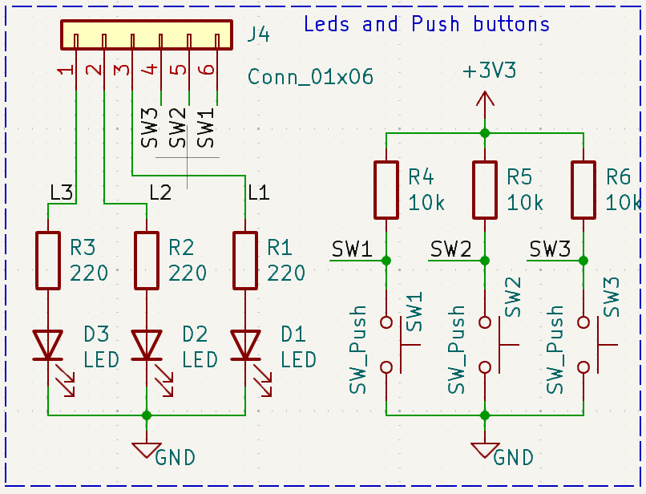

# Bloques de periféricos

## Interruptores y leds

La siguiente figura muestra el esquemático de este sencillo bloque de
periféricos, que es común para las dos versiones de la placa.

Por un lado tenemos tres leds (D1-D3) con el cátodo conectado a GND. El ánodo de
cada uno de ellos se conecta a una resistencia de polarización de 220 Ohmios,
cuyo otro extremo se conecta a uno de los pines de la tira J4. Podemos usar esos
pines de J4 para conectarlos a un pin libre de la raspberry pi usando un cable
dupont hembra-hembra. Entonces desde un programa que ejecute en la raspberry pi
podemos enceder el correspondiente led si ponemos el pin seleccionado a 1 (Vdd),
ya que entonces la corriente en el led será de aproximadamente 7 mA: (3.3 -
1.8)/220 = 7 mA.

Por otro lado, tenemos tres pulsadores de botón (SW1-SW3), con un terminal
conectado a GND y el otro conectado a una resistencia que a su vez conecta a la
alimentación (3.3 V). El punto entre la resistencia y el pulsador de botón se
conecta a uno de los pines de la tira J4. Estos pines pueden conectarse a alguno
de los GPIOs de la raspberry pi usando un cable dupont hembra-hembra. Si dicho
GPIO se configura como entrada podremos usarlo para ver si el pulsador está
pulsado (el valor leído del pin será 0) o sin pulsar (el valor leído del pin
será 1). Siempre habrá que tener en cuenta que en los cambios de estado se
producirán rebotes, debido principalmente a las oscilaciones mecánicas del
muelle incluido en el pulsador. Estos rebotes pueden ser filtrados por software.
