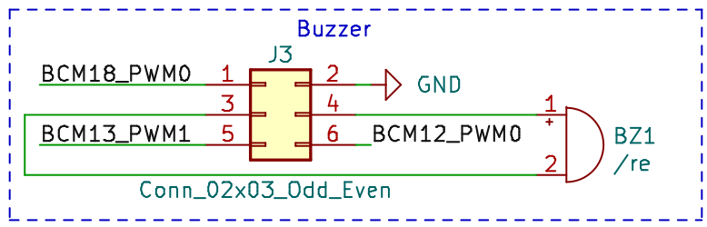
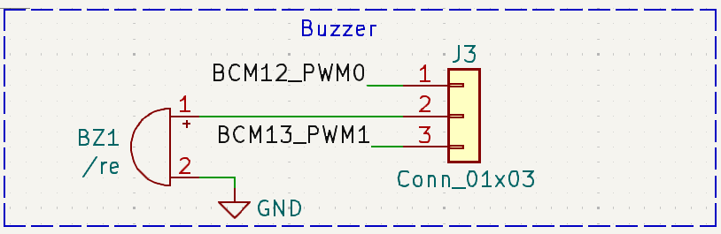
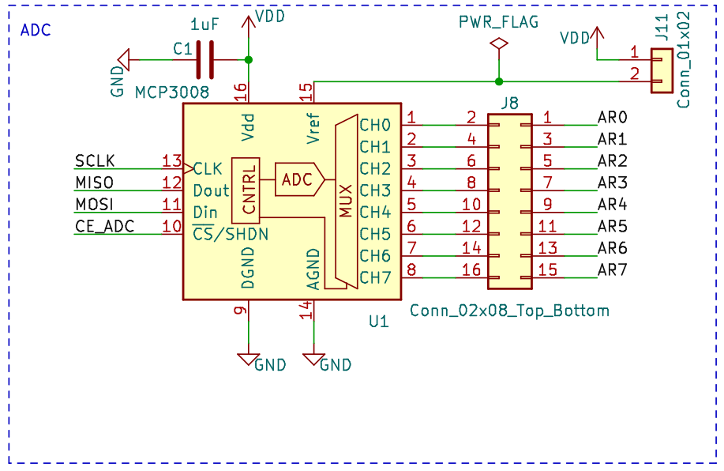
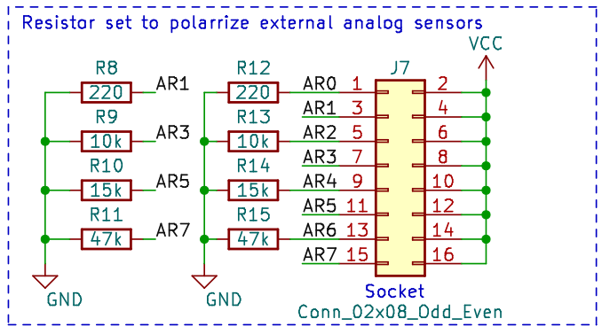
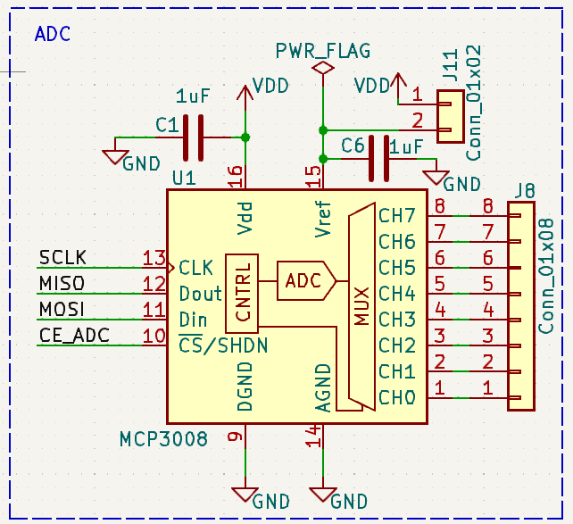
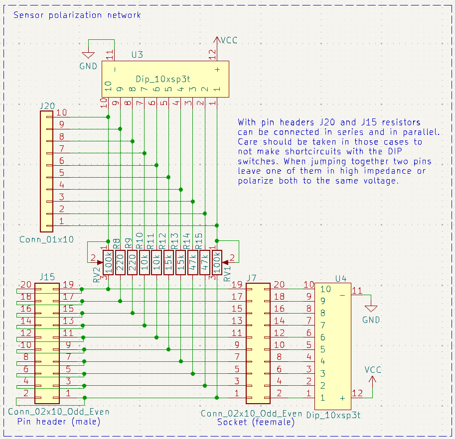

# Bloques de periféricos

## Interruptores y leds

La siguiente figura muestra el esquemático de este sencillo bloque de
periféricos, que es común para las dos versiones de la placa.

Por un lado tenemos tres leds (D1-D3) con el cátodo conectado a GND. El ánodo de
cada uno de ellos se conecta a una resistencia de polarización de 220 Ohmios,
cuyo otro extremo se conecta a uno de los pines de la tira J4. Podemos usar esos
pines de J4 para conectarlos a un pin libre de la raspberry pi usando un cable
dupont hembra-hembra. Entonces desde un programa que ejecute en la raspberry pi
podemos enceder el correspondiente led si ponemos el pin seleccionado a 1 (Vdd),
ya que entonces la corriente en el led será de aproximadamente 7 mA: (3.3 -
1.8)/220 = 7 mA.

Por otro lado, tenemos tres pulsadores de botón (SW1-SW3), con un terminal
conectado a GND y el otro conectado a una resistencia que a su vez conecta a la
alimentación (3.3 V). El punto entre la resistencia y el pulsador de botón se
conecta a uno de los pines de la tira J4. Estos pines pueden conectarse a alguno
de los GPIOs de la raspberry pi usando un cable dupont hembra-hembra. Si dicho
GPIO se configura como entrada podremos usarlo para ver si el pulsador está
pulsado (el valor leído del pin será 0) o sin pulsar (el valor leído del pin
será 1). Siempre habrá que tener en cuenta que en los cambios de estado se
producirán rebotes, debido principalmente a las oscilaciones mecánicas del
muelle incluido en el pulsador. Estos rebotes pueden ser filtrados por software.

## Zumbador (Buzzer)

Las dos versiones montan el mismo zumbador piezoeléctrico
([datasheet](https://www.mouser.es/datasheet/2/400/iezoelectronic_buzzer_ps_en-1131915.pdf)).
La siguiente figura muestra el esquemático del circuito en la versión 1 de la
placa BEE. Como vemos, los terminales del zumbador se conectan a los dos pines
centrales de una tira de pines 2x3 (J3), estando el resto de pines de la tira
conectados a tierra (2) y los pines 18 (1), 13 (5) y 12 (6) de la raspberry pi.
Como indica la web [pinout.xyz](https://pinout.xyz/), estos pines adicionales
pueden configurarse con las funciones PWM0, PWM1 y PWM0 respectivamente.

Este circuito se modificó en la versión 2 de la placa, como muestra la siguiente
figura. En este caso los terminales del zumbador se han conectado diréctamente a
tierra y al terminal central de una tira de pines 1x3 (J3). Los pines restantes
de esta tira se han conectado a los pines 12 (PWM0) y 13 (PWM1) de la raspberry
pi.

En ambos casos puede usarse un jumper para conectar el zumbador al pin 12 (PWM0)
o el 13 (PWM1), y probar así el uso del zumbador con señales PWM generadas con
los cotroladores internos del microcontrolador. En la versión 1 de la placa
deberemos usar otro jumper para conectar el otro extremo a tierra.

## Conversor Analógico Digital (ADC)

En ambas versiones de la placa se monta un conversor analógico digital MCP3008,
con las siguientes características:

- 10 bits de resolución 
- 8 canales de entrada
- Interfaz SPI
- Entrada independiente para el voltaje de referencia

Los esquemáticos de la conexión del ADC en las dos versiones de la placa se
muestran y explican a continuación. Sólo se difieren en la conexión de las
entradas analógicas, debido a la modificación que se realizó en la red de
polarización de sensores.

En la primera versión las entradas analógicas se conectan a uno de los lados de
un socket 2x8 (J8), conectando el otro lado a una tira de pines 2x8 (J7), por el
lado en el que están conectadas una serie de resistencias de polarización
habituales (220, 10k, 15k y 47k) cuyo otro extremo está conectado a tierra. El
otro extremo de la tira de pines se conecta a la alimentación analógica (Vcc).
De esta forma, podemos conectar un sensor analógico de dos patas en el socket
(J8), teniendo una de las patas conectada a la entrada analógica del ADC y la
otra pata conectarla directamente a Vcc o a tierra a través de una de las
resistencias de pull-down conectadas a J7.

Aunque este circuito permite conectar fácilmente muchos sensores analógicos al
ADC, teníamos limitaciones de las resistencias a escoger, y no podíamos usar
resitencias de pull-up. Esto se modificó en la segunda versión de la placa, en
la que se redefinió la red de polarización para facilitar la conexión serie o
paralelo de las resistencias incluidas, así como su conexión como conjuto de
pull-up o pull-down. El esqumático se muestra a continuación:

Este circuito está pensado para conectar al ADC fácilmente sensores analógicos
de dos terminales, donde una de los terminales debe ir conectado directamente a
GND o Vcc, mientras que el otro debe ir conectado a una resistencia de pull up o
pull down. La salida del sensor se toma entonces del terminal conectado a la
resistencia. En estos casos, el sensor se conecta al socket J7, escogiendo la
posición que lleve a la resistencia que necesitamos, y usando los micro
interruptores de U3 y U4 para conectar a GND o VCC tanto el sensor como la
resistencia seleccionada. La salida del sensor estará entonces disponible en la
tira de pines J15, y podemos usar un cable dupont hembra-hembra para conectarla
a la entrada del ADC deseada, disponible en J8. Si ninguna de las resistencias
que hay en el circuito es la resistencia que necesitamos tenemos dos opciones:

- Conectar dos (o más) de las resistencias disponibles en serie o paralelo para
  obtener la resistencia deseada. Para ello podemos usar las tiras de pines J15
  y J20, y en algún caso un cable dupont.

- Usar los potenciómetros incluidos en la red de polarización, utilizando un
  destornillador pequeño para ajustarlo y un multímetro para medir su valor.

