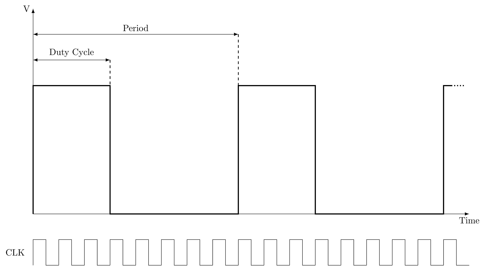

# Control PWM en Linux

En esta práctica vamos a estudiar cómo podemos utilizar los controladores PWM
desde un programa de usuario en Linux.

## Señales PWM

Las señales de modulación de ancho de pulso (Pulse Width Modulation, PWM) se
describen en la siguiente figura:



Se trata de una señal rectangular de un periodo fijo, en la que la fracción del
periodo en que la señal toma un valor distinto de cero se define como *duty
cycle*. Sin embargo, muchos interfaces de control PWM toman el duty cycle como
el tiempo absoluto en que la señal está activa, que debe ser menor que la
duración (absoluta) del periodo. Este tipo de señales se utilizan frecuentemente
para el control de servos y la conversión digital analógica (en ausencia de
DAC).

## Interfaz sysfs

En la raspberry pi hay dos controladores pwm hardware, con la misma señal de
reloj (19.2 MHz). Aunque puede obtenerse su salida por varios pines distintos,
para la placa de expansión BEE es conveniente usar para el pwm0 el pin 18 o el
pin 12 y para el pwm1 el pin 13. Los dos controladores son usados por el sistema
de audio.

El driver de pwm ofrece actualmente un interfaz a través del sistema virtual de
ficheros sysfs. Debe ser habilitado cargando el overlay pwm-2chan. Esto puede
hacerse de dos formas:

- Dinámicamente con:
    ```bash 
    sudo dtoverlay pwm-2chan pin=18 func=2 pin2=13 func2=4
    ```
- En arranque, si añadimos al fichero \texttt{config.txt} la línea:
    ```bash 
    dtoverlay=pwm-2chan,pin=18,func=2,pin2=13,func2=4
    ```

Una vez habilitado nos aparecerá el directorio `/sys/class/pwm/pwmchip0` con los
siguientes ficheros: device, export, npwm, power, subsystem, uevent y unexport.

Para poder usar los canales pwm primero hay que exportarlos escribiendo el
número del canal a usar en el fichero export:

```bash 
$ echo 0 > /sys/class/pwm/pwmchip0/export
$ echo 1 > /sys/class/pwm/pwmchip0/export
```

Una vez exportados nos aparecerán dos nuevos directorios: *pwm0* y *pwm1*, con
los siguientes ficheros: *capture*, *duty_cycle*, *enable*, *period*,
*polarity*, *power* y *uevent*. El sistema genera un *evento udev* cuando
aparecen y hay que esperar este evento para poder continuar (ver ejemplo).

Una vez que se dispare el evento podemos usar un canal. Para ello debemos seguir
el siguiente procedimiento:

1. Escribir el periodo en ns en el fichero *period* 
2. Escribir el duty cycle en ns en el fichero *duty_cycle*
3. Escribir un 1 en el fichero *enable*

Podemos cambiar dinámicamente el periodo y/o el duty cycle o apagar un canal
escribiendo un 0 en el fichero *enable*. Cuando queramos dejar de usar un canal
deberemos escribir su número en el fichero *unexport*.


Como ejemplo, el script bash [servo_cont_rot.sh](src/servo_cont_rot.sh) ofrece
un interfaz de línea de comandos para el control de un servo de rotación
continual de parallax. Si se dispone de uno de estos servos, se puede probar
conectándolo a los pines indicados arriba. Podemos ejecutar el script sin
parámetros o con -h para ver la lista de opciones.

El programa [servo_control.c](src/servo_control.c) es un ejemplo de como
controlar el mismo servo de rotación continua de parallax desde un programa C.
Utiliza 3 pulsadores conectados a tres pines del gpio para controlar el servo.
El programa recibe como argumentos: el fichero del controlador gpio, el canal de
pwm a usar y los tres pines a usar como entrada. Uno de los botones permite
decrementar el duty cycle, otro incrementarlo y otro parar el servo. El programa
exporta el canal pwm indicado y espera a que el kernel notifique que está
montado (esperando eventos de udev). Si el pwm ya está exportado da un aviso
pero sigue adelante.

## PWM por software

En lugar de utilizar controladores PWM hardware, es posible utilizar pines
genéricos del GPIO para generar una señal PWM por software. Si es posible, sería
mejor crear para ello una tarea de tiempo real, aunque esto queda fuera del
alcance de esta práctica.

Tenemos dos alternativas:

- Usar *clock_nanosleep* con el flag *TIMER_ABSTIME*, usando dos intervalos, uno
  para el periodo y otro para el duty cycle. De esta forma, se espera
  (*clock_nanosleep*) un periodo,

- Usar timers POSIX, con un timer periódico para el periodo y uno one shot para
  el duty cycle, activado en cada periodo. 

Probar estas alternativas se deja como ejercicio al estudiante interesado.

La limitación de esta estrategia es la precisión de la señal, que estará
expuesta a la variabilidad del tiempo de respuesta del kernel (jitter). Este
jitter puede llegar a medirse con un osciloscopio. Puede mejorarse utilizando un
kernel de tiempo real y tareas de tiempo real.

