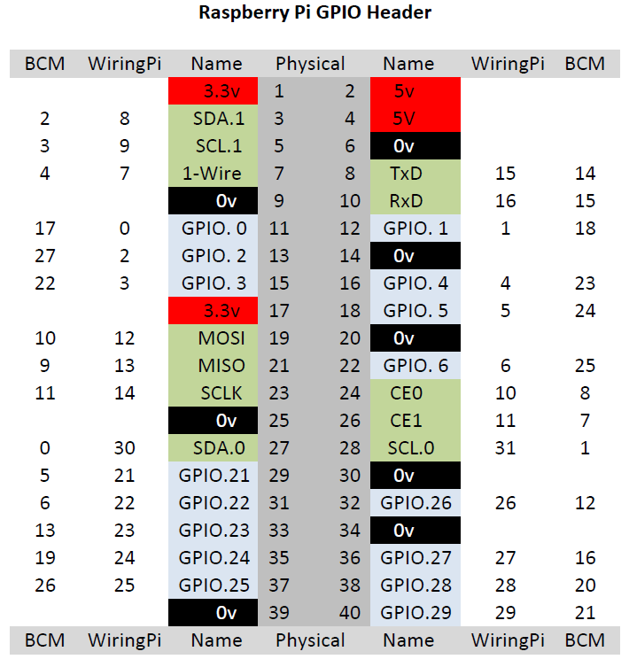

# Prácticas de Robótica


## Motores. Parte 1

### Objetivos

1. Familiarizarse con la Raspberry Pi y su entorno.
2. Generación de una señal para control de un motor paso a paso.
3. Generación de una señal (PWM) para control de un servomotor.

La finalidad de esta práctica es aprender a generar señales en el orden adecuado para mover un motor paso a paso y aplicar una señal de PWM para controlar un motor de continua (servomotor de rotación continua). Estos tipos de motores son muy utilizados en Robótica. En concreto, el servo de rotación continua se utilizará para controlar un robot móvil sencillo.

!!! note "Nota"

    Antes de ejecutar un programa, verifique con su profesor que las conexiones
    están realizadas correctamente.

### Desarrollo de la práctica

Para familiarizarse con el entorno de programación de la Raspberry Pi, primero
vamos a realizar dos tareas sencillas.

**Tarea 1: Conocer el entorno de la Raspberry**

Alimenta la Raspberry Pi y conecta el portátil a ella (vea cómo conectar con la Raspberry Pi). Una vez conectado, cambia al directorio `wiringPi/examples`. Allí hay un archivo denominado `blink.c`.

Lo que haremos será comprobar que está funcionando correctamente la Raspberry: compila el programa escribiendo:


``` bash 
make blink
```

Observa que se crea un ejecutable.

**Tarea 2: "Hola Mundo" hardware**

El objetivo de esta tarea es programar el parpadeo de un LED. Para ello, en primer lugar, habrá que realizar el montaje indicado en la siguiente figura:


Conecta el LED al Pin GPIO 17 (el Wiring Pin 0). La resistencia utilizada es de 220 Ω.

Dependiendo de la biblioteca software que usemos para programar la Raspberry, la numeración de los pines cambia. En la siguiente figura pueden verse las distintas numeraciones según el conector físico de 40 pines. La placa de conexiones Bee 2.0 sigue la numeración BCM. De este modo, el pin serigrafiado en la placa como B17 corresponde al pin físico 11 o al WiringPi 0.



Si ahora ejecutamos el programa anterior:

```sh 
sudo ./blink
```

Se verá que el LED parpadea.

**Edita el programa, cambia la frecuencia de parpadeo, vuelve a compilarlo y observa que su frecuencia cambia.**

También puede conectarse el LED en otro Pin de la Raspberry, pero en ese caso hay que cambiar el pin asignado en el archivo blink.c:
``` c 
#define 0 LED
```

#### Control de motores de rotación continua

El servomotor no debe ser alimentado directamente por la Raspberry Pi porque en caso de que requiera realizar un esfuerzo grande puede requerir un consumo que no puede proporcionar la Raspberry. La alimentación del servo se realizará externamente y SOLO el pin de control del motor (PWM) se conectará a la Raspberry.


**Tarea 3: Control por pwm de servomotres usando C++**

Para controlar los motores por pwm en C o C++ se puede usar la biblioteca WiringPi. Al igual que en python conviene tener en cuenta los siguientes aspectos:

- Es necesario incluir la librería en el código:

``` c 
#include <wiringPi.h>
```
- La biblioteca WiringPi usa otra numeración de pines, como se indicaba anteriormente. Los pines correspondientes según la numeración WiringPi a los *pwm_0* y *pwm_1* son:

``` c
#define PinMotor0 23 //pwm_1
#define PinMotor1 26 //for pwm_0
```

- Es necesario inicializar la librería

- Hay que configurar el pin como un pin pwm de salida

- Para dar un valor de pwm a la salida correspondiente basta con usar el comando

**Establece el rango de valores de PWM sirven para girar en un sentido u otro. Con este rango podrás escoger un valor adecuado para usarlo en el futuro control del robot.**


### Referencias útiles
- [Control de servomotor usando Python 1](https://www.digikey.es/en/maker/blogs/2021/how-to-control-servo-motors-with-a-raspberry-pi}{Control de servomotor usando Pyhton 1)
- [Control de servomotor usando Python 2](https://www.learnrobotics.org/blog/raspberry-pi-servo-motor/}{Control de servomotor usando Pyhton 2)
- [Referencia de WiringPi](http://wiringpi.com/reference/raspberry-pi-specifics/)
- [ Utilidad gpio de Adafruit](https://learn.adafruit.com/adafruits-raspberry-pi-lesson-8-using-a-servo-motor/software)

---

## Motores. Parte 2

### Objetivos

La finalidad de esta práctica es aplicar una señal de PWM para
controlar los actuadores (servomotores de rotación continua) de un robot móvil sencillo.
Una vez que se mueven adecuadamente los dos motores del robot de tipo diferencial
construido, se realizarán varios movimientos para mostrar que se es capaz de controlar
adecuadamente el robot.

### Desarrollo de la práctica

#### Preparación

El robot utilizará dos servos de rotación contínua. Aseguraos de que están alineados adecuadamente y las ruedas están fijadas para que el robot pueda moverse en línea recta. Si el robot tiene una deriva alta, su control será más complejo e impedirá un correcto funcionamiento en futuras prácticas en las que se utilizará.

1. Colocad sobre la plataforma el circuito anterior y la Rasp Pi para mover los motores a la vez. 

2. Si el diseño y sujeción de los motores es el adecuado debe ser capaz de moverse en línea recta sin desviarse. Como mínimo debería recorrer un tramo de unos 2 m con una desviación máxima de un 10% hacia cualquiera de los dos lados.

#### Control en lazo abierto

Una vez que se ha comprobado que sabe crear un programa utilizando la librería wiringPi, se ha configurado y calibrado los servos de las ruedas del robot y movido el robot de forma básica para verificar que la posición de los motores es la adecuada, el objetivo será crear un programa que mueva el robot una distancia y ángulo deseados. Como el robot no tiene realimentación de la posición cualquier error, deslizamiento o desviación no se detectará.

Para mover el robot una distancia deseada, mediremos la velocidad con que se desplaza el robot (velocidad de las ruedas) y moveremos el robot (siempre a la misma velocidad) durante el tiempo que corresponda para la distancia deseada. Es decir:

1. Poned las ruedas a girar y registrad el tiempo que tarda en dar 10 vueltas. Ese tiempo será T_i

2. Para obtener la velocidad de cada rueda por segundo bastará con realizar v_i=T_i/10 vueltas por segundo.

3. Es necesario medir el radio de las ruedas para poder calcular la longitud de su circunferencia y así saber la distancia que recorre el robot en una vuelta.

4. Con estos datos ya se puede pasar una distancia recorrida por una rueda  a número de vueltas. Con la velocidad de la rueda que ya se ha calculado se puede saber el tiempo que ha de estar girando la rueda.

5. Este tiempo es que se debe esperar antes de parar los motores para que el robot mueva las ruedas la distancia deseada.


Con los cálculos anteriores puede obtener el tiempo para que cada rueda gire la distancia  deseada. Esta distancia se obtendrá de las ecuaciones y  del modelo de un robot diferencial, donde la distancia a desplazarse (o el ángulo que queremos que gire) es la proporcionada por el usuario.

**Tarea 1: Movimiento en línea recta.**

Programad  el robot para que se mueva una distancia determinada a partir del tiempo que está en funcionamiento los motores (control en lazo abierto). Probadlo con la distancia del apartado anterior y ved si es capaz de parar a los 2 m.

**Tarea 2: Giro en lazo abierto**

Programad el robot para que gire el número de ángulos determinado. Probadlo con 90 grados.

**Tarea 3: Movimiento complejo del robot**

A continuación realizaremos, utilizando las ecuaciones anteriores, un movimiento algo más complejo donde se combinen simultáneamente movimientos rectos y giros. El movimiento que el robot realizará será un rectángulo.

**Tarea 4: Movimientos complejos**

El robot debería quedar en la misma posición que al principio. Estimar el error cometido. ¿Está dentro de una bola de error de radio 10 cm?

---

## Sensores

### Objetivos

1. Lectura de sensores digitales con la RaspberryPi. 

2. Lectura de sensores analógicos con la RaspberryPi. 

3. Integración de sensores en el robot 

La finalidad de esta práctica es que el alumno utilice distintos sensores típicos en un robot móvil. Se utilizarán:

- **Interruptor**: señal binaria (todo o nada) 

- **LDR**: señal de voltaje variable (analógica, requiere conversor A/D) 

- **Sensor de ultrasonidos**: señal procesada, salida digital

!!! note "Nota"

    Antes de ejecutar un programa verifica con tu profesor que las conexiones
    están realizadas correctamente.

### Desarrollo de la práctica

#### Lectura de sensores digitales

##### Botones

Un sensor muy utilizado en los robots son los sensores de contacto. Estos pueden ser de distintos tipos siendo los más utilizados los de botón y los de palanca. Con ellos se reconoce la presencia de un objeto ubicado en la línea de recorrido de un dispositivo. También se pueden emplear (los botones) típicamente como interfaz con el usuario. Su simplicidad de construcción y uso los hace muy empleados en robótica.

En esta práctica se van a usar los tres botones que están integrados en la placa Bee 2.0. 


Los botones integrados en la placa Bee 2.0 tienen tres patillas: 

- GND 

- 3.3 V (a través de resistencia de 10kΩ) 

- Pin del conector J4 

Los LEDs están conectados a GND y al conector J4 a través de una resistencia de 220Ω.


Para poder usar los botones simplemente tendremos que unir con un cable la patilla libre del
botón (aquella que está conectada con uno de los pines del conector J4 a una de las entradas
digitales de la RaspberryPi (por ejemplo la entrada BCM0)

**Tarea 1: Activar el LED con el botón**
 
Conecta un botón y un LED a pines de entrada/salida digital de la RaspberryPi. 

Programa: encender LED si el botón está pulsado, apagar si no.

**Funciones WiringPi:**

``` c 
digitalRead(pinToRead);
digitalWrite(pinToWrite, value); // value = 1 (alto), 0 (bajo)
```

Configura los pines como `INPUT` o `OUTPUT`.

##### Sensor de infrarrojos CNY70

El CNY70 es un sensor óptico reflexivo de infrarrojos de corto alcance (de 0, 3 a 10 mm.) basado en un diodo emisor de luz infrarroja y un receptor formado por un fototransistor, ambos apuntando en la misma dirección, y cuyo funcionamiento se basa en la capacidad de reflexión del objeto, y la detección del rayo reflectado por el receptor (sensor óptico de proximidad).


Al tener un alcance tan corto, no se suele utilizar para detectar obstáculos, sino como sensor de
proximidad, componente de lectura para un encoder, como elemento para detección y seguimiento
de líneas u otras aplicaciones similares. Podemos usar el CNY70 de dos formas:

1. Como un sensor digital que nos proporciona un 0 o un 1 en caso de que haya objeto o en para
distancias de entre [0, 10] mm.

2. Como un sensor analógico, midiendo la señal que proporciona el sensor dependiendo de la
situación que se desee.

Vamos a emplearlo en primer lugar como sensor de proximidad, lo que quiere decir que será un
sensor digital que nos informará si hay objeto o no únicamente.
Para poder usar este sensor hay que tener en cuenta dos cosas:

- Polarizar LED emisor con resistencia a GND 

- Usa divisor de tensión si trabajas con Raspberry Pi (3.3V)


**Tarea 2: Lectura del sensor CNY70** 

Conecta sensor a entrada digital. 
Crea un `for` con `delay` (500 o 1000 ms) y muestra en pantalla la lectura.

**Tarea 3: Rango del sensor** 

Prueba el rango de detección del sensor.

**Tarea 4: Comportamiento con diferentes colores** 

Usa objetos de diferentes colores. ¿Detecta todos? ¿Por qué?

#### Sensores analógicos

Existen sensores que proporcionan una señal analógica (normalmente una señal de voltaje) que es
proporcional a la medida que queremos leer. Este es el caso de muchos sensores de temperatura,
de presión, de humedad, de luz, etc.

Las RaspberryPi 3 no tiene entradas analógicas, de manera que necesitaremos usar un conversor
AD para pasar la señal analógica a la digital. La placa Bee v2.0 tiene integrado un conversor AD, el MCP3008 que permite conectarle una señal analógica y transformarla en una digital que la
Raspberry puede leer.

##### (Light-Dependent Resistor)

Un LDR (Light-Dependent Resistor) es un material que varía su valor de resistencia eléctrica dependiendo de la cantidad de luz que incide sobre él. Se le llama, también, fotorresistor o fotorresistencia. El valor de resistencia eléctrica de un LDR es bajo cuando hay luz incidiendo en él (en algunos casos puede descender a tan bajo como 50Ω ) y muy alto cuando está a oscuras (puede ser de varios M Ω).

Los LDR se fabrican con un cristal semiconductor fotosensible como el sulfuro de cadmio (CdS).
Estas celdas son sensibles a un rango amplio de frecuencias lumínicas, desde la luz infrarroja,
pasando por la luz visible, y hasta la ultravioleta.

La variación de valor resistivo de un LDR tiene cierto retardo, que es diferente si se pasa de
oscuro a iluminado o de iluminado a oscuro. Por esta razón un LDR no se puede utilizar en algunas aplicaciones, en especial en aquellas en que la señal luminosa varía con rapidez. El tiempo de respuesta típico de un LDR está en el orden de una décima de segundo. La lentitud relativa del cambio es una ventaja en algunos casos, porque así se filtran variaciones rápidas de iluminación que podrían hacer inestable un sensor (por ejemplo, cuando está iluminado por un tubo fluorescente alimentado por corriente alterna), En otras aplicaciones (como la detección de luminosidad para saber si es de día o es de noche) la lentitud de la detección no es importante.

Para ver cómo cambia la resistencia con la luz, podemos hacer un circuito como el de la figura, donde el punto de lectura del voltaje se realiza en (1). Estos tipos de sensores son muy dependientes de la iluminación ambiente, por lo que es necesario protegerlos de la luz o realizar una calibración para tener en cuenta la iluminación actual que sería previa a su utilización, periódicamente, o cuando cambien las condiciones de trabajo.


Para conectarlo a la Raspberry, utilizaremos como alimentación los 3.3 voltios del GPIO para
Vdc. En cuanto a la lectura del voltaje en el punto (1), dado que es una señal analógica, necesitaremos un conversor A/D. Debido a que la Raspberry Pi no dispone de ninguno, en nuestro caso, utilizaremos el integrado MCP3008.

El MCP3008 es un convertidor de analógico a digital, de 8 canales de 10 bits (conversor AD
o ADC). Es barato, fácil de conectar y no requiere ningún componente adicional. Se utiliza el
protocolo de bus SPI que está soportado por el GPIO de la Raspberry Pi y por tanto puede utilizarse también con la librería WiringPi.

Como puede verse en la figura los pines del lado derecho del MCP3008 son las entradas
analógicas (los 8 canales analógicos), AGND y DGND son la tierra analógica y digital, VDD la
alimentación del integrado y VREF el voltaje de referencia de la entrada analógica. Los pines 10-14 (CS,Din,Dout,Clk) corresponden a los pines del protocolo serie SPI por donde se lee la conversión del voltaje. Para conocer el voltaje en un canal se utilizará la fórmula:

**Fórmula:**

$$ V_{canal} = (LecturaSPI / 1024) * Vref $$


La placa Bee v2.0 tiene integrado el conversor MCP3008, figura 8. Para emplearlo hay que:

- Unir con un jumper los pines MOSI, MISO, SCLK y CE0 ADC del conector J2 con los B10, B9
B11 y B8 del mismo conector.

- Unir con un jumper los dos pines del conector J11

- Unir con un jumper los pines Vcc y 3.3 del conector J18

- Unir con un jumper los pines Vdd y 3.3 del conector J14

Una vez hecho esto, ya se puede conectar la salida analógica del sensor (con la resistencia R
adecuada, que puede usarse de la red de polarización) a una de las entradas del conversor A/D


**Cargar drivers SPI:**
``` bash 
gpio load spi
```

**Código base (conversor.c):** 

[https://osoyoo.com/2017/06/29/raspberry-pi-mcp3008/](https://osoyoo.com/2017/06/29/raspberry-pi-mcp3008/)


**Tarea 5: Lectura sensor LDR** 

Lee y muestra el voltaje del LDR.

**Tarea 6: Efecto de la luz ambien** 

Observa efecto de luz ambiente. ¿Cómo afecta a la medida? 
¿Cómo usarlo para encender una bombilla si baja la luz?

**Tarea 7: Comportamiento ante distintas fuentes de luz** 

Comprueba variación con distintas fuentes de luz.

**Tarea 8: Robot sigue-luz** 

¿Cómo construirías un robot que siga una fuente de luz (como una linterna)?


