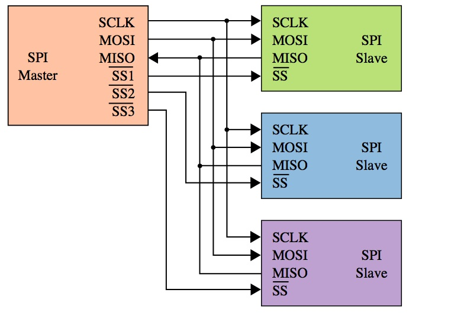
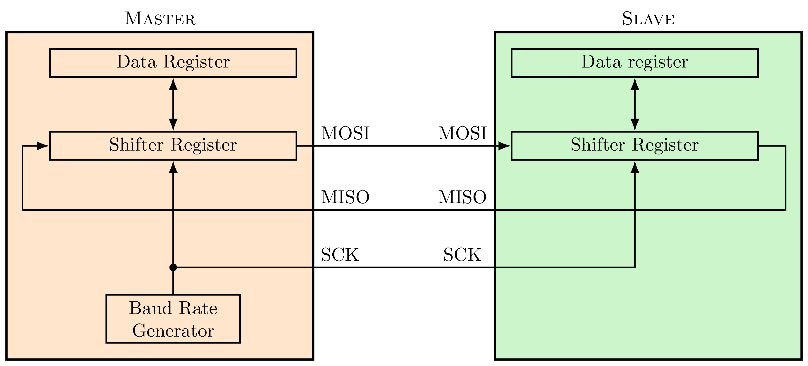
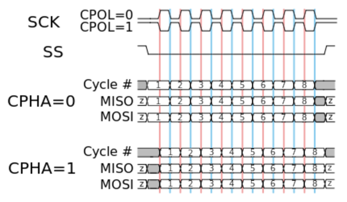
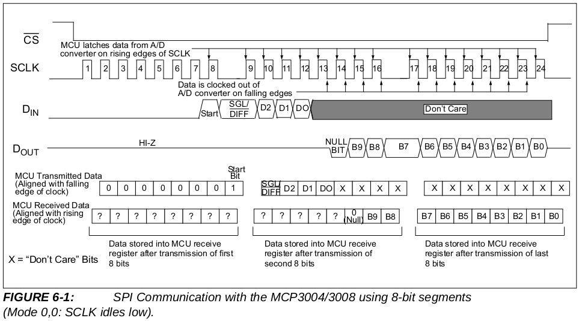

# Control de dispositivos SPI

En esta práctica vamos a ver cómo podemos manejar dispositivos conectados al
controlador spi utilizando el driver spi de Linux. Comenzaremos recordando
brevemente el funcionamiento del bus spi, ya que es necesario entenrlo para
manejar el driver y los dispositivos. Al final probaremos lo que hemos aprendido
utilizando el ADC incluido en la placa BEE.

## Bus SPI

El Serial Peripheral Interface (SPI) es un bus serie síncrono y bidirccional muy
utilizado en sistemas empotrados para conectar un microcontrolador a sus
periféricos. Puede trabajar con frecuencias de 1 a 20 MHz, pero sólo un
dispositivo puede ser máster del bus. El bus utiliza 4 líneas más una tierra
común:

- Master out/Slave in (*MOSI*, *SDI*)
- Master in/Slave out (*MISO*, *SDO*)
- Serial clock (*SCK*)
- Slave Select (*nSS*):  activo a baja

Los dispositivos SPI pueden funcionar en dos modos

- **Master**: es el que puede iniciar y controlar una transferencia
- **Slave**: es el que se comunica con un master que le active

El máster selecciona al slave con el que quiere comunicarse activando su señal
SS (poniéndola a 0). Si un dispositivo puede hacer de máster o slave, puede
configurar el pin *nSS* como entrada para ver si otro módulo está actuando como
master. Si se detecta otro máster el dispositivo debe configurarse en modo
slave. 




En SPI el envío y la recepción suceden simultáneamente, el bus funciona como un
registro de desplazamiento circular distribuido. Se suele utilizar un sistema de
doble buffer. El master y el slave tienen un registro de datos de 8 bits
utilizado por el software para escribir el dato a transmitir o leer el dato
recibido. También disponen de un registro de desplazamiento de 8 bits. 

El procediminto de transmisión se ilustra en la figura de abajo. Pongamos por
ejemplo que el master quiere envíar un byte a un esclavo. Para transmitir se
empieza copiando el dato en el registro de datos, que después se copia en el
registro de desplazamiento. Luego, en cada pulso de la señal *SCK* (generada por
el máster) se desplaza una posición el contenido de éste registro, enviando así
por la línea MOSI un bit. El esclavo hace el mismo desplazamiento, enviando a su
vez un bit al master por la linea MISO. Ambos dispositivos usan el bit recibido
como bit de relleno de su registro de desplazamiento. Este procedimiento
continúa hasta que se hayan transmitido los 8 bits. Es configurable si se
rellena por el bit más significativo (MSB) o menos significativo (LSB).



SPI tiene esencialmente dos modos de transmisión, ilustrados en la figura de
abajo, que son:

- CPHA = 0: 
    - El slave puede poner el primer bit en *MISO* en cuanto es seleccionado
    - Los bits son latcheados/capturados en flancos impares de *SCK* 
    - El shifter se desplaza en flancos pares de *SCK*, rellenando con el bit
      capturado y transmitiendo así un nuevo bit

- CPHA = 1:
    - El slave necesita un flanco en SCK para poner el primer bit en *MISO*
    - Los bits son latcheados/capturados en flancos pares de *SCK*
    - El shifter se desplaza en flancos impares de *SCK*, 
      rellenando con el bit capturado y transmitiendo así un nuevo bit

Estos dos modos tienen a su vez dos variantes que determinan la polaridad de
*SCK*:
    - *CPOL = 0*: SCK activo a alta, inactivo a baja
    - *CPOL = 1*: SCK activo a baja, inactivo a alta



## Driver SPI en Linux

Linux proporciona un driver spi genérico, que expone controladores como
dispositivos de caracteres (*/dev/spidev#.#*). Para realizar una transmisión, lo
primero es abrir el fichero de dispositivo. Después usaremos una serie de
operaciones *ioctl* para configurar el modo de transmisión requerido por el
dispositivo:

- *SPI_IOC_RD_MODE*, *SPI_IOC_WR_MODE*: recibe un puntero a byte para leer o
  escribir el modo de transmisión básico. Los valores válidos son:
  *SPI_MODE_{0,1,2,3}*
- *SPI_IOC_RD_LSB_FIRST*, *SPI_IOC_WR_LSB_FIRST*: recibe un puntero a byte para
  leer o escribir el bit order. Un valor 0 es MSB first y cualquier otro valor
  es LSB first.
- *SPI_IOC_RD_BITS_PER_WORD*, *SPI_IOC_WR_BITS_PER_WORD*: recibe un puntero a
  byte, para leer o escribir el número de bits en cada palabra spi transferida.
  Un valor 0 significa 8 bits.
- *PI_IOC_RD_MAX_SPEED_HZ*, *SPI_IOC_WR_MAX_SPEED_HZ*: recibe un puntero a
  uint32 para leer o escribir la frecuencia de transmisión.


Una vez configurado el modo de transmisión, usaremos una operación
*SPI_IOC_MESSAGE(n)* para realizar envío y recepción simultáneos. Esta operación
recibe un puntero a un array de **n** elementos del tipo `struct
spi_ioc_transfer`:

```c 
struct spi_ioc_transfer {
    __u64 tx_buf;  // dirección del buffer para transmision
    __u64 rx_buf;  // dirección del buffer para recepción

    __u32 len;     // longitud de tx_buf y rx_buf
    __u32 speed_hz;// velocidad para esta transferencia

    __u16 delay_usecs;   // retardo para subir nCS
    __u8  bits_per_word; // bits por palabra
    __u8  cs_change;     // subir nCS entre medias
    __u8  tx_nbits;      // num de bits a transmitir
    __u8  rx_nbits;      // num de bits a recibir
    __u8  word_delay_usecs; // retardo entre palabras
    __u8  pad;
};
```

## Ejemplos: MCP3008 y DAC MCP4911

El MCP3008 es un ADC de 10 bits y 8 canales, que pueden ser utilizados en modo
diferencial o en modo independiente. Este ADC tiene un interfaz SPI. La placa
BEE tiene montado uno de estos ADCs, que podemos conectar a la Raspberry Pi a
través de los jumpers en la tira de pines J2. La siguiente figura muestra un
cronograma de una comunicación SPI entre un microcontrolador y el ADC, extraída
de la [hoja de características del
MCP3008](http://ww1.microchip.com/downloads/en/DeviceDoc/21295d.pdf)
(*datasheet*) proporcionada por el fabricante:



El siguiente código es un ejemplo de cómo leer el ADC utilizando el driver SPI
explicado arriba, siguiendo las directrices del cronograma:

```c 
#define MCP3008_START 0x1
#define MCP3008_SIGL_DIFF (0x1 << 7)

__u8 spi_mode = (__u8) SPI_MODE_0;
int channel = 0;
struct spi_ioc_transfer xfer[1];
unsigned char buf[3];
int adcval;

fd = open("/dev/spidev0.0", O_RDWR);
ioctl(fd, SPI_IOC_WR_MODE, &spi_mode);

memset(xfer, 0, sizeof xfer);
memset(buf, 0, sizeof buf);

buf[0] = MCP3008_START;
buf[1] = MCP3008_SIGL_DIFF | ((channel & 0x7) << 4);
xfer[0].tx_buf = (__u64) buf;
xfer[0].rx_buf = (__u64) buf;
xfer[0].len = sizeof buf;
xfer[0].speed_hz = 1350000; //1.35 MHz
ioctl(fd, SPI_IOC_MESSAGE(1), xfer);
adcval = ((buf[1] & 0x3) << 8) | buf[2];
```

El programa [adc_read.c](src/adc_read.c) lee una vez por segundo el valor de uno
de los canales del adc de la placa BEE y muestra la tensión correspondiente a la 
medida por la salida estándar. Para usarlo podemos ejecutar el programa con los
siguientes parámetros:

```c 
./adc_read /dev/spidev0.0 0 3300
```
- */dev/spidev0.0*: es el controlador spi a usar
- *0*: el canal del adc que leer
- *3300*: la tensión vdd que alimenta al ADC en mV.


El programa [dac_follow_adc.c](src/dac_follow_adc.c) es similar al anterior,
pero además copia en el dac el valor leído del adc, de modo que la salida del
dac va siguiendo la entrada del adc.

Para comprobar el funcionamiento de estos programas deben conectarse una serie
de jumpers en la BEE:

- Jumpers en la tira de pines J2
- Jumpers para selección de VDD y VCC en J14 y J18 (escoger 3.3V)
- Jumper de tensión de referencia del ADC en J11.
- Jumper de tensión de referencia del DAC (no numerado).
- Jumper J9 de nLDAC.


